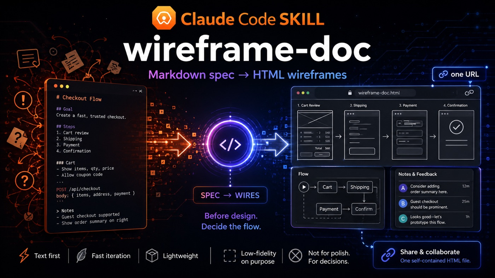
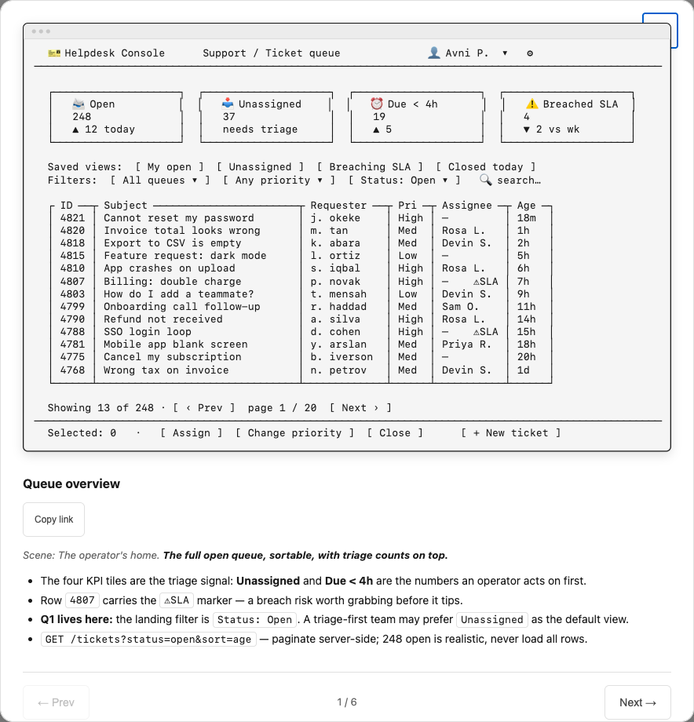

[](CHANGELOG.md)
[](LICENSE)

# wireframe-doc

> Figma is for designing. **wireframe-doc is for deciding what to design.**

A Claude Code skill that turns a Markdown spec into a single self-contained HTML
page of low-fidelity screen wireframes — ASCII frames in device chrome, a flow
diagram, reviewer notes — that you share as one URL. ~50 KB for a small deck,
~215 KB for a large multi-flow one — no design tool, no export. Built for the
messy moment before design: when you need cofounders or your team reacting to
the screens in your head.



*A rendered deck — device-framed screens, flow diagram, and reviewer notes, shared as one URL. Every screen is authored as plain Markdown ASCII.*

## The problem

The fastest way to align on a product flow is to show people the screens. But
the tools for that are heavy — Figma means a license, a learning curve, and a
~1.8 MB export for what's still just a sketch. So the screens stay in your head,
or in a doc nobody can picture, and you commit to a design before anyone's
reacted to the flow.

## Who it's for

- Founders, pre-design — get cofounders reacting to a flow before you spend a design cycle on it.
- Product and engineering with no designer in the loop — sketch the screens, drop the link in Slack, read the notes when people get to them.
- Anyone who'd otherwise send a heavy Figma export — replace it with a URL that opens on a phone.

## wireframe-doc vs a real design tool

| | wireframe-doc | Figma / design tool |
|---|---|---|
| Stage | Before design — deciding the flow | During design — making it real |
| Fidelity | Low-fi, intent over polish | Pixel-perfect |
| Output | One ~50–215 KB URL | ~1.8 MB file / export |
| Audience | Cofounders, team, async reviewers | Designers, stakeholders |

Use wireframe-doc to decide what to build. Switch to a real design tool to make it look right.

---

## Quick start

1. Copy `assets/spec-template.md` to your project
2. Fill in frontmatter + scene + open questions + frames + notes
3. Render: `node scripts/wireframe-render.mjs your-spec.md output.html`
4. Open `output.html` in a browser, or deploy to any static host
5. Share the URL — or use a frame's **Copy link** button to share one screen for discussion

---

## Author a wireframe doc

1. Copy `assets/spec-template.md` to a new folder:
   ```
   cp ~/.claude/skills/wireframe-doc/assets/spec-template.md my-project/wireframes/spec.md
   ```
2. Fill in the YAML frontmatter (title, version, date, frame_count, deploy_url, and optionally default_device).
3. Write the **Set the scene** body — what stream this covers, scope, who shouldn't weigh in, what's NOT in this draft.
4. List 2-4 **Open questions** as bullets.
5. Draw the **Stream → screens** Mermaid flowchart using frame keys as node IDs (or omit to auto-generate a linear graph).
6. For each flow, add `## {Flow name}` sections with `### Frame: {Name}` blocks:
   - `key: {kebab-key}` — REQUIRED on the line immediately after `### Frame:`
   - `device: {phone|tablet|desktop|custom WxH}` — OPTIONAL override for this frame's viewport
   - One scene line (optional flavor text)
   - ASCII block (see syntax below)
   - `**Notes:**` + content (full Markdown supported)

---

## Render command

```
node scripts/wireframe-render.mjs <input.md> <output.html> [--lenient]
```

Example:
```
node scripts/wireframe-render.mjs my-spec.md output.html
```

The script prints a one-line success message with file size and frame count. Warnings and errors go to stderr.

**`--lenient` flag:** warn instead of error for `frame_count` mismatches and invalid `device:` values.

---

## Deploy

The render output is a **single self-contained HTML file**. Deploy it to any static host:

- **Vercel** — `vercel deploy --prod --yes` (add a `vercel.json` with root rewrite)
- **Netlify** — drag-and-drop the HTML file to Netlify Drop
- **GitHub Pages** — commit the HTML as `index.html` to `gh-pages` branch
- **Amazon S3** — upload as a public static object with `Content-Type: text/html`
- **Local review** — `open output.html` in any browser (no server required; CDN deps load from jsDelivr)

---

## Spec syntax cheatsheet

| Syntax | What it does |
|--------|--------------|
| `## {Flow name}` | Defines a flow section (e.g., `## Onboarding flow`) |
| `### Frame: {Name}` | Defines a frame within the current flow |
| `key: {kebab-key}` | Frame key — REQUIRED, on the line right after `### Frame:`. Used as Mermaid node IDs and the deep-link anchor (`#frame-{key}`) behind each frame's **Copy link** button. Must be lowercase kebab-case, unique per doc. |
| `device: {value}` | Per-frame device override — OPTIONAL, placed after `key:` and before the scene paragraph. Values: `phone` / `tablet` / `desktop` / `custom WxH` (e.g., `custom 1440x900`). |
| Paragraph after `### Frame:` line | Optional scene/flavor text (after `key:` and `device:` lines) |
| ` ```ascii ` block | Screen *contents* (monospace, whitespace preserved). The device frame is the screen border — **don't draw an outer box**; internal panels/tables are fine. Emoji ≈ 2 columns. |
| `**Notes:**` + content | Reviewer notes — full Markdown supported (bullets, paragraphs, nested lists, blockquotes, code, headings) |
| ` ```mermaid ` block under `## Stream → screens` | Flow diagram using frame keys as node IDs. The renderer substitutes frame headings as labels. If omitted, a linear graph is auto-generated. |

**YAML frontmatter fields:**
- `title` — page title + header h1
- `version` — shown in header (e.g., `v0`, `v1`)
- `date` — ISO date (YYYY-MM-DD)
- `frame_count` — total frame count (validated against actual count — error on mismatch; `--lenient` to warn)
- `deploy_url` — URL without `https://` (shown in header + footer)
- `default_device` — OPTIONAL. Default device for all frames. Values: `phone` (default) / `tablet` / `desktop` / `custom WxH`.

**Device dimensions** (recognizable 1× logical viewports; height is a screen-shape floor — a longer screen still grows):
- `phone` → 390 × 844 (iPhone 14/15) — **default**
- `tablet` → 768 × 1024 (iPad portrait)
- `desktop` → 1280 × 800 (laptop, 16:10)
- `custom WxH` → W × H (e.g., `custom 1440x900`)

Each rendered frame is a **screen with a bezel** (2px border, device corners, a status strip on phone/tablet, a browser-chrome bar on desktop/custom). The screen is the chrome — **you don't draw an outer box**, just the screen contents. Content is clipped at the bezel like a real screen.

**ASCII sizing — FILL THE SCREEN (the #1 quality rule):**
The device frame is a real screen, not a sticky note. Author enough content to **fill it** — header/title, body, actions, often a bottom bar. A few short lines in a big empty screen looks broken. Match **both** the column and row target:

| Device | Columns | Rows | Renders at |
|--------|---------|------|------------|
| `phone` (390×844) | **≈ 34–44** | **≈ 36–44** | ~13–17px |
| `tablet` (768×1024) | **≈ 70–95** | **≈ 44–56** | ~12–17px |
| `desktop` (1280×800) | **≈ 95–125** | **≈ 28–34** | ~16–21px |
| `custom WxH` | **≈ W ÷ 10** | **≈ H ÷ 22** | ~16px |

The renderer scales the font so the widest line fills the width and rows fill the height. Keep every line the same display width so internal panels align. **Emoji are welcome as icons** — counted as 2 columns, so budget 2 cells each. A genuinely sparse screen (a one-line confirmation) is fine; the default is a populated screen. Art far narrower than target renders chunky; far wider is clamped (min 7px, max 22px) and clipped at the bezel.

**Rich Markdown:**
Four content areas support full GitHub-flavoured Markdown (rendered client-side by marked.js):
- Set the scene body
- Open questions block
- Per-frame scene line
- Per-frame notes

Supported: bold, italic, inline code, links, blockquotes, unordered + ordered lists, nested lists, horizontal rules, `h3`/`h4` headings, multi-paragraph content.

HTML in Markdown is sanitized by DOMPurify — unsafe tags (`<script>`, `<iframe>`, event handlers) are stripped. Safe tags render normally.

ASCII blocks (` ```ascii ` fences) stay literal in `<pre>` for correct monospace rendering.

**CDN fallback:** if Mermaid or marked.js fail to load, raw source is shown as `<pre>` after 2 seconds.

**Mermaid integration:**
- Use frame keys directly as node IDs in the Mermaid block
- The renderer substitutes frame headings as labels (e.g., `landing` becomes `landing["Landing page"]`)
- Words inside brackets/quotes (label text) are NOT validated as frame keys — only bare node identifiers are checked
- Validation: if a bare Mermaid node ID doesn't match any frame key, the render exits with an error (typo catcher)
- Warning: if a frame key is absent from the Mermaid diagram, the renderer warns
- Auto-generation: if the `## Stream → screens` block is omitted entirely, the renderer auto-generates a linear `graph LR; key1 --> key2 --> ...` from frame order

**Sharing one frame:** every frame has a **Copy link** button (with a hover/focus education tooltip explaining the use case) — the primary way a reviewer shares a single screen for discussion. It copies the frame's deep link, whose underlying form is `#frame-{key}` (e.g., `#frame-landing`); position-independent, so anchors don't change when you reorder frames. Opening a shared link highlights the linked frame with a "Shared frame" marker so the recipient sees exactly which screen was sent.

---

## Iteration

1. Edit the source `.md` — change one `### Frame:` block or add a new flow.
2. Re-run: `node scripts/wireframe-render.mjs <input.md> <output.html>`
3. Re-deploy (if hosted)
4. Share the root URL — previous versions stay live for comparison.

Per-frame edits are cheap: one `### Frame:` block → one card in the output HTML.

---

## Examples

| Directory | Description |
|-----------|-------------|
| `examples/minimal/` | 2-frame spec — smallest valid example |
| `examples/multi-flow/` | 5-frame spec with 2 flows + desktop device |
| `examples/dashboard/` | 6-frame desktop example — support-ticket console, dense tables/charts, one `custom 1440x900` frame |
| `examples/stress-test/` | Real-world-scale stress test |

---

## Tests

See `tests/fixtures/` and `tests/fixtures/EXPECTED.md`.
