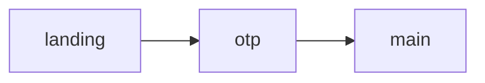

# [Doc title]

<!--
DRAWING FRAMES — the device frame IS the screen.
Don't draw an outer box around a frame. The rendered device has a screen
bezel (2px border, device corners, a status strip / browser bar). You draw
the screen *contents*. Internal panels, tables and cards in box-drawing are
fine — just no outer ┌──┐ … └──┘ wrapper.

FILL THE SCREEN — this is the #1 rule. The device frame is a real screen,
not a sticky note. Author a header/title, the body, actions, often a bottom
bar — enough to fill it. A few short lines in a big empty screen looks
broken. Match BOTH the column and row target:

  phone   (390×844)   → ≈ 34–44 cols  × ≈ 36–44 rows  (~13–17px)
  tablet  (768×1024)  → ≈ 70–95 cols  × ≈ 44–56 rows  (~12–17px)
  desktop (1280×800)  → ≈ 95–125 cols × ≈ 28–34 rows  (~16–21px)
  custom  WxH         → ≈ W ÷ 10 cols × ≈ H ÷ 22 rows (~16px)

The renderer scales the font so the widest line fills the width and the
rows fill the height. Keep every line the same display width so internal
panels align.

CRAFT — read SKILL.md § "Authoring great wireframes" for the full system.
The essentials:
  • SCREEN = pure ASCII + emoji ONLY. Markdown does NOT render here —
    no ##, **, ``` (literal clutter). Hierarchy = a title + ──── rule,
    UPPERCASE, boxes, a leading ▸. Compose top bar → body → bottom bar.
  • NOTES/scene = rich Markdown (it DOES render): **bold** the decision,
    > blockquote the open question, `code` for fields, - [ ] criteria.
  • Use the curated emoji set as icons (nav 🔍 🏠 ⚙️ 🔔 👤 / status 🟢 ⚠️
    ✅ / objects 📊 📋 👥 / actions ➕ ✏️ 🗑️ 💾) — 2 cells each, clarify
    not decorate, one consistent set per doc.
  • Use the ASCII component vocabulary (buttons [ X ], inputs, [x]/(•),
    [ Option ▾ ], tables, ███░░ progress, ▁▂▆█ sparklines, • list rows).
  • Add a tiny legend line for any non-obvious symbols.

A genuinely sparse screen (a one-line confirmation) is fine;
the default is a populated screen. This comment is ignored by the renderer;
delete it or keep it, your call.
-->

## Set the scene

[Plain English: which user flow this covers, scope, feedback requested,
who shouldn't weigh in, what's NOT in this draft.]

**Markdown is supported here.** Use `**bold**`, `_italic_`, `` `code` ``, and `> blockquotes`
to highlight decisions and signal status.

> Example: _This draft covers the onboarding flow only — settings and profile screens are **out of scope**._

## Open questions for the team

- Q1 — [decision needed] — include `code spans` or **bold** to mark critical choices
- Q2 — [decision needed]
- Q3 — [decision needed]

## Stream → screens



## Onboarding flow

<!--
OPTIONAL decision-flow cards. The fenced ```flow blocks just below are the
"decided logic" for this flow — keep, edit, or delete them. They COMPLEMENT
the Mermaid screen-map (Mermaid = which screens connect; this = the rules
that decide what the user sees). The text after ```flow on the fence line is
the card TITLE; the block BODY is rendered verbatim in monospace (Markdown
does NOT render; it is NOT a screen — no device chrome). You may add MANY
named cards under one flow heading (before the first ### Frame:) — they
render as separate titled panels in document order. A bare ```flow fence
with no title still renders (untitled card). The six moves: fan-in entry ·
▼ progression · a question · ├─/└─ branches · indented sub-options ·
(parenthetical aside) + free-prose tail. #frame-{key} becomes a link — keep
links OPTIONAL, SPARSE, on decided OUTCOMES (leaves) only; never a node per
screen (that just re-draws Mermaid).
-->

```flow Entry & identity
arrives via link or direct URL
            │
            ▼
  Already verified on this device?
  ├─ yes → skip OTP, go straight in
  └─ no  → send code, collect it  → #frame-otp
           (resend allowed after 60s)
```

```flow Code retry policy
code submitted
        │
        ▼
  Correct?
  ├─ yes → continue into the app
  └─ no  → show attempts left, allow resend after 60s
```

### Frame: Landing
key: landing

Scene: Entry point. _User arrives via link or direct URL._

```ascii
┌──────────────┐
│  [App logo]  │
│              │
│  Welcome     │
│              │
│  [Continue]  │
└──────────────┘
```

**Notes:**
- Entry point — describe what the user has done to get here
- What data is pre-filled vs. blank?
- Q: what does the user already know at this point?

### Frame: OTP entry
key: otp

Scene: User enters a verification code.

```ascii
┌──────────────┐
│  Enter code  │
│              │
│  [_][_][_]  │
│  [_][_][_]  │
│              │
│  Resend in   │
│  00:45       │
└──────────────┘
```

**Notes:**
- 6-digit code, auto-submit on digit 6
- Resend timer: 60s countdown
- **Critical:** retry limit — show remaining attempts after first failure

## Main flow

### Frame: Main screen
key: main

Scene: [One line describing what the user sees and why they're here.]

```ascii
┌──────────────┐
│              │
│  [content]   │
│              │
│  [CTA]       │
└──────────────┘
```

**Notes:**
- [Bullet notes for reviewers — `**bold**` marks critical decisions]
- [One note per concern or open question]
- [Include backend deps, edge cases, copy questions]
