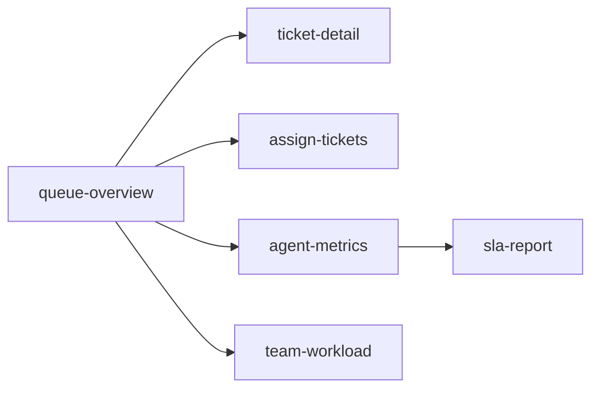

# Helpdesk — Support Ticket Queue Console

## Set the scene

A desktop admin console for a support team that triages and resolves customer tickets. This spec walks the daily operator loop: scan the queue, open a ticket, reply or escalate, clear the unassigned backlog in bulk, and read the team's metrics and SLA health.

This is the **desktop example**. Every frame is `device: desktop` except the team-workload board, which uses a `custom 1440x900` viewport. It doubles as the renderer's densest ASCII-fit case — wide tables, KPI cards, and ASCII charts that must fill a 1200px frame and read like a real screen.

**In scope:** queue triage, ticket detail, bulk assignment, agent metrics, SLA reporting, team workload.
**Out of scope:** the customer-facing portal, knowledge base, billing internals, and auth configuration.

> _Neutral sample data — names, ticket subjects, and numbers are illustrative only._

## Open questions for the team

- 🟢 **Q1** — Should the queue land on **Unassigned** or **All open**? `queue-overview` shows All open today.
- ⏱️ **Q2** — On `ticket-detail`, is the SLA timer trustworthy enough to show a hard countdown ("due in 0h 38m"), or should it be a band ("< 1h")?
- 🔀 **Q3** — `assign-tickets`: is round-robin or manual pick the right default for bulk assignment?
- 🔄 **Q4** — Does `team-workload` need live auto-refresh, or is a manual refresh acceptable for v1?

## Stream -> screens



## Triage and resolve

### Frame: Queue overview
key: queue-overview
device: desktop

Scene: The operator's home. **The full open queue, sortable, with triage counts on top.**

```ascii
  🎫 Helpdesk Console      Support / Ticket queue              👤 Avni P.  ▾   ⚙                   
────────────────────────────────────────────────────────────────────────────────────────────────────
                                                                                                    
  ┌────────────────────┐  ┌────────────────────┐  ┌────────────────────┐  ┌────────────────────┐    
  │   📨 Open          │  │   📥 Unassigned    │  │   ⏰ Due < 4h       │  │   ⚠️ Breached SLA  │    
  │   248              │  │   37               │  │   19               │  │   4                │    
  │   ▲ 12 today       │  │   needs triage     │  │   ▲ 5              │  │   ▼ 2 vs wk        │    
  └────────────────────┘  └────────────────────┘  └────────────────────┘  └────────────────────┘    
                                                                                                    
  Saved views:  [ My open ]  [ Unassigned ]  [ Breaching SLA ]  [ Closed today ]                    
  Filters:  [ All queues ▾ ]  [ Any priority ▾ ]  [ Status: Open ▾ ]   🔍 search…                   
                                                                                                    
  ┌ ID ──┬ Subject ───────────────────────┬ Requester ──┬ Pri ─┬ Assignee ─┬ Age ─┐                 
  │ 4821 │ Cannot reset my password       │ j. okeke    │ High │ —         │ 18m  │                 
  │ 4820 │ Invoice total looks wrong      │ m. tan      │ Med  │ Rosa L.   │ 1h   │                 
  │ 4818 │ Export to CSV is empty         │ k. abara    │ Med  │ Devin S.  │ 2h   │                 
  │ 4815 │ Feature request: dark mode     │ l. ortiz    │ Low  │ —         │ 5h   │                 
  │ 4810 │ App crashes on upload          │ s. iqbal    │ High │ Rosa L.   │ 6h   │                 
  │ 4807 │ Billing: double charge         │ p. novak    │ High │ —    ⚠SLA │ 7h   │                
  │ 4803 │ How do I add a teammate?       │ t. mensah   │ Low  │ Devin S.  │ 9h   │                 
  │ 4799 │ Onboarding call follow-up      │ r. haddad   │ Med  │ Sam O.    │ 11h  │                 
  │ 4790 │ Refund not received            │ a. silva    │ High │ Rosa L.   │ 14h  │                 
  │ 4788 │ SSO login loop                 │ d. cohen    │ High │ —    ⚠SLA │ 15h  │                
  │ 4781 │ Mobile app blank screen        │ y. arslan   │ Med  │ Priya R.  │ 18h  │                 
  │ 4775 │ Cancel my subscription         │ b. iverson  │ Med  │ —         │ 20h  │                 
  │ 4768 │ Wrong tax on invoice           │ n. petrov   │ Med  │ Devin S.  │ 1d   │                 
  └──────┴────────────────────────────────┴─────────────┴──────┴───────────┴──────┘                 
                                                                                                    
  Showing 13 of 248 · [ ‹ Prev ]  page 1 / 20  [ Next › ]                                           
────────────────────────────────────────────────────────────────────────────────────────────────────
  Selected: 0   ·   [ Assign ]  [ Change priority ]  [ Close ]      [ + New ticket ]                
```

**Notes:**
- The four KPI tiles are the triage signal: **Unassigned** and **Due < 4h** are the numbers an operator acts on first.
- Row `4807` carries the `⚠SLA` marker — a breach risk worth grabbing before it tips.
- **Q1 lives here:** the landing filter is `Status: Open`. A triage-first team may prefer `Unassigned` as the default view.
- `GET /tickets?status=open&sort=age` — paginate server-side; 248 open is realistic, never load all rows.

### Frame: Ticket detail
key: ticket-detail
device: desktop

Scene: One ticket — full conversation thread, with the metadata and actions rail on the right.

```ascii
  ‹ Back to queue      Ticket #4807 — Billing: double charge        High · Open ▾                   
────────────────────────────────────────────────────────────────────────────────────────────────────
  Conversation                                  │  Details                                          
                                                │  Requester  p. novak                              
  ┌ p. novak · 7h ago ─────────────────────┐    │  Email      p.novak@example.com                   
  │ I was charged twice for the May plan.   │    │  Queue      Billing                              
  │ Order #A-22841. Please refund the       │    │  Priority   High                                 
  │ duplicate.                              │    │  Assignee   — unassigned                         
  └─────────────────────────────────────────┘    │  SLA        ⚠ due in 0h 38m                     
                                                │  Created    Today 09:14                           
  ┌ Rosa L. · internal note · 5h ago ───────┐    │  Plan       Team · $49/mo                        
  │ Confirmed two captures in the ledger.   │    │  Tags       billing, refund                      
  │ Refund needs a lead approval > $50.     │    │                                                  
  └─────────────────────────────────────────┘    │  ── Actions ───────────────────                  
                                                │  [ Assign to me ]                                 
  ┌ Avni P. · 2h ago ───────────────────────┐    │  [ Escalate to lead ]                            
  │ Approved. Issue a one-charge refund of  │    │  [ Issue refund ]                                
  │ $49 to the card ending 4471.            │    │  [ Close ticket ]                                
  └─────────────────────────────────────────┘    │                                                  
                                                │  ── Activity ──────────────────                   
  ┌ Reply ──────────────────────────────────┐    │  09:14  created by requester                     
  │ Type a reply…                           │    │  11:30  note added · Rosa L.                     
  │                                         │    │  14:02  approved · Avni P.                       
  └─────────────────────────────────────────┘    │                                                  
  [ Send reply ]   [ Send & close ]   [ ⤴ ]      │  Linked  #4790 (same payer)                      
```

**Notes:**
Three things this layout has to get right:

1. The **SLA countdown** is the most-glanced element — keep it in the rail, visible without scrolling.
2. Internal notes (Rosa L.'s note) must be visually distinct from customer messages — an internal note must never be emailed to the requester.
3. The action rail is ordered by frequency: _Assign to me_ first, _Close ticket_ last.

> **Q2 is about the SLA line.** "due in 0h 38m" is precise but can alarm — and can be wrong if the timer drifts. A band ("< 1h") is safer but vaguer.

`POST /tickets/4807/reply` and `POST /tickets/4807/assign` are separate calls — a reply must not silently reassign.

### Frame: Bulk assign
key: assign-tickets
device: desktop

Scene: Clearing the unassigned backlog in one pass. **Multi-select on the left, the assignment rule on the right.**

```ascii
  Bulk assign        14 tickets selected from “Unassigned”           ✕ close                       
────────────────────────────────────────────────────────────────────────────────────────────────────
  Selected                                      │  Assign to                                        
  [x] 4807  Billing: double charge      High    │  ( ) Round-robin (whole team)                     
  [x] 4821  Cannot reset password       High    │  (•) Pick an agent                                
  [x] 4815  Feature request: dark mode  Low     │                                                   
  [x] 4799  Onboarding call follow-up   Med     │   Agent          Open   Cap.                      
  [x] 4790  Refund not received         High    │   ( ) Rosa L.     14    ███▌  ok                  
  [x] 4788  SSO login loop              High    │   (•) Devin S.     9    ██▍   ok                  
  [x] 4781  Mobile app blank screen     Med     │   ( ) Priya R.    21    █████ full                
  [x] 4775  Cancel my subscription      Med     │   ( ) Sam O.       6    █▌    ok                  
  [x] 4770  API rate limit unclear      Low     │   ( ) Avni P.     11    ███   ok                  
  [x] 4768  Wrong tax on invoice        Med     │   ( ) Lee K.       4    █     ok                  
  [x] 4761  Duplicate account merge     Med     │                                                   
  [x] 4755  Data export GDPR request    High    │  Notify agent   [x] in-app  [ ]@                  
  [x] 4749  Webhook 500 on retry        High    │  Set status     [ Keep Open ▾ ]                   
  [x] 4742  Seat count mismatch         Med     │  Add tag        [ + ]                             
  [ ] 4737  Typo in onboarding email    Low     │                                                   
  [ ] 4730  Docs: API key rotation      Low     │  Devin S. → 9 + 14 = 23 after                     
  ────────────────────────────────────────────  │  ⚠ pushes Devin over soft cap                    
  14 of 16 selected   [ Select all ]            │                                                   
────────────────────────────────────────────────────────────────────────────────────────────────────
  [ Select none ]                                  [ Cancel ]   [ Assign 14 → ]                     
```

**Notes:**
- The capacity bars (`███▌`) beside each agent are the point — never assign into someone already `full`.
- **Q3 lives here:** the panel offers round-robin _or_ manual pick. Which is the default?
- Bulk assign is one transaction: all 12 move or none do. Show a per-ticket failure list if any are stale.
- Edge case: a selected ticket may have been grabbed by someone else since the list loaded — re-check at submit time.

## Insight and reporting

### Frame: Agent metrics
key: agent-metrics
device: desktop

Scene: Team performance for the last 7 days. **A KPI strip, a ranked bar chart, and a daily-volume trend.**

```ascii
  📊 Agent metrics      Last 7 days · Support team           [ Export ]  [ 7d ▾ ]                   
────────────────────────────────────────────────────────────────────────────────────────────────────
                                                                                                    
  ┌────────────────────┐  ┌────────────────────┐  ┌────────────────────┐  ┌────────────────────┐    
  │   Resolved         │  │   Avg first        │  │   Avg handle       │  │   CSAT             │    
  │   612              │  │   24m              │  │   3h 41m           │  │   4.6/5            │    
  │   ▲ 8% vs prev     │  │   reply time       │  │   ▼ 11m            │  │   from 318 rtgs    │    
  └────────────────────┘  └────────────────────┘  └────────────────────┘  └────────────────────┘    
                                                                                                    
  Resolved per agent · 7d                       │  Daily resolved · this week                       
  Rosa L.  ████████████████████ 142             │   150 ┤               ▆   █                       
  Devin S. ██████████████████   128             │   100 ┤         ▄   ▆  █   █                      
  Priya R. ████████████████     116             │    50 ┤  ▂   ▄  █   █  █   █                      
  Sam O.   ██████████████        98             │     0 └─────────────────────                      
  Avni P.  ████████████          86             │        M    T   W   T    F                        
  Lee K.   ██████                42             │                                                   
                                                                                                    
  By queue          Resolved   Avg handle   CSAT    Backlog                                         
  ─────────────────────────────────────────────────────────────────                                 
  Billing              188      4h 02m      4.5     ▆▆▇█  72                                        
  Login & SSO          146      2h 51m      4.7     ▅▆▆▇  41                                        
  Mobile app           121      5h 18m      4.4     ▇█▇█  58                                        
  Data & export         84      3h 33m      4.6     ▄▅▆▆  39                                        
  Onboarding            73      2h 09m      4.8     ▃▄▄▅  22                                        
  ─────────────────────────────────────────────────────────────────                                 
  Total                612      3h 41m      4.6           248                                       
                                                                                                    
  Backlog burn-down: 312 → 248 open over the window. Inflow 7d avg 91/day,                          
  resolve 7d avg 87/day — net +4/day. See SLA report for breach detail.                             
────────────────────────────────────────────────────────────────────────────────────────────────────
  [ Export CSV ]   [ Schedule weekly email ]               Updated 12:41 · auto 60s                 
```

**Notes:**
- The charts are intentionally ASCII — this is a wireframe. The decision is _which_ metrics and _what shape_, not the final chart library.
- "Resolved per agent" is a ranked bar; "Daily resolved" is the inflow/outflow shape the lead reads for staffing.
- The burn-down line is the headline: a net **+4/day** means the queue is slowly growing — a staffing signal.
- `CSAT 4.6/5 from 318 ratings` — always show the denominator; an average without sample size misleads.

### Frame: SLA report
key: sla-report
device: desktop

Scene: SLA compliance for the month, by priority, with the week's breaches listed.

```ascii
  SLA report          May 2026 · First-response & resolution targets   [ 30d ▾ ]                    
────────────────────────────────────────────────────────────────────────────────────────────────────
  Target: first response < 4h (High) / < 8h (Med) / < 24h (Low)                                     
                                                                                                    
  Priority   Volume   Met      Breached   Met %    Trend (4 wks)                                    
  ─────────────────────────────────────────────────────────────────────                             
  High         184     176        8        95.6%   ▆▅▇█  improving                                  
  Medium       402     391       11        97.3%   ▇▇▆▇  steady                                     
  Low          228     226        2        99.1%   ████  steady                                     
  ─────────────────────────────────────────────────────────────────────                             
  All          814     793       21        97.4%   ▆▆▇█  improving                                  
                                                                                                    
  By queue        Volume   Met %    Worst miss                                                      
  ─────────────────────────────────────────────────────────────                                     
  Billing           246     96.3%   +2h 20m  (#4612)                                                
  Login & SSO       198     97.0%   +1h 50m  (#4590)                                                
  Mobile app        172     98.3%   +0h 41m  (#4655)                                                
  Data & export     124     99.2%   +1h 10m  (#4571)                                                
  Onboarding         74    100.0%   —                                                               
                                                                                                    
  Breached this week (4)                                                                            
  #4807  Billing: double charge   High   due 09:52   closed 11:30   +1h 38m                         
  #4612  SSO login loop           High   due 14:00   closed 16:20   +2h 20m                         
  #4590  Payment webhook failing  High   due 08:15   closed 10:05   +1h 50m                         
  #4571  Export GDPR request      High   due 12:00   closed 13:10   +1h 10m                         
────────────────────────────────────────────────────────────────────────────────────────────────────
  Goal: 97% first-response.  This month 97.4% ▲.    [ Export ]  [ Email weekly ]                    
```

**Notes:**
- The table answers one question: _are we hitting our response targets, and where are we not?_
- The breach list is sorted by overage, worst first, so the lead reads the most damaging miss first.
- High-priority `Met %` is the number that goes in the weekly review — keep it above the fold.
- Each breach row links back to its `ticket-detail` (e.g. `#4807`) so a reviewer can see what happened.

### Frame: Team workload
key: team-workload
device: custom 1440x900

Scene: A live capacity heatmap across queues × agents. **Custom 1440×900 viewport** — a wide board that needs the extra width.

```ascii
  🗂 Team workload        Live capacity across queues × agents       custom 1440×900 view                             
──────────────────────────────────────────────────────────────────────────────────────────────────────────────────────
  Cell = open tickets.  legend:  · 0-3    ░ 4-8    ▒ 9-14    █ 15+      updated 12:41                                 
  Filters:  [ All queues ▾ ]   [ All agents ▾ ]   [ Shift: Day ▾ ]      🔄 auto-refresh 60s                           
                                                                                                                      
  Queue \ Agent     Rosa L.   Devin S.  Priya R.  Sam O.    Avni P.   Lee K.    Row total                             
  ────────────────────────────────────────────────────────────────────────────────────                                
  Billing            ▒  11     ░  6      █  17     ░  5      ·  2      ·  1        42                                 
  Login & SSO        ░  7      ▒  9      ░  8      ·  3      ░  4      ·  2        33                                 
  Mobile app         ·  3      ░  5      ▒  12     ░  6      ░  7      ·  1        34                                 
  Data & export      ░  4      ·  3      ░  8      ▒  10     ·  2      ·  0        27                                 
  Onboarding         ·  2      ░  4      ░  6      ·  3      ▒  9      ░  5        29                                 
  API & webhooks     ░  5      ░  7      ·  3      ░  4      ·  1      ░  6        26                                 
  Identity & auth    ░  4      ░  5      ▒  9      ·  2      ░  4      ·  1        25                                 
  Integrations       ·  3      ░  6      ░  7      ░  5      ·  2      ░  4        27                                 
  ────────────────────────────────────────────────────────────────────────────────────                                
  Column total        39        45        62        38        31        20       235                                  
  Capacity            ok        ▒ busy    █ FULL    ok        ok        light                                         
  Shift ends          17:00     17:00     15:30     19:00     17:00     21:00                                         
                                                                                                                      
  ── Rebalance suggestions ───────────────────────────────────────────────────────────                                
  ⚠️ Priya R. is over capacity (62).  Move 8 Mobile-app + 4 Identity tickets out.                                     
     →  Sam O.  (+6, lands at 44)        →  Lee K.  (+6, lands at 26)                                                 
  ⚠️ Devin S. trending busy (45).  Pause new round-robin assignment until < 35.                                       
  ✅ Lee K. has spare capacity (20).  Prefer for new High-priority Billing tickets.                                   
                                                                                                                      
  [ Apply suggested rebalance ]    [ Export snapshot ]            Next refresh in 0:48                                
```

**Notes:**
This frame uses a **custom 1440x900 viewport** specifically to exercise the renderer's custom-device path with a very wide grid — a 6-queue by 6-agent matrix does not fit a standard desktop frame comfortably.

- The legend (`· ░ ▒ █`) encodes load bands; the raw count sits beside each cell for the exact number.
- `Priya R.` is flagged over capacity — the suggested rebalance line is the action, not just the data.
- **Q4 lives here:** is a manual refresh acceptable, or does a workload board need to auto-update?

> Reading order matters: the column totals and `Capacity` row are the summary; the matrix is the detail behind it.
