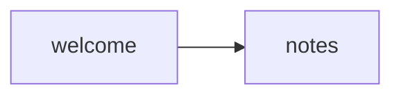

# NoteApp — Onboarding flow

## Set the scene

This is the smallest valid wireframe doc. Two frames, one flow, one open question.

The onboarding flow covers: new user lands on the app → enters their name → reaches the main note-taking screen. Authentication is out of scope for this draft.

## Open questions for the team

- Q1 — Is a name field necessary at onboarding, or can we skip to the note screen and capture it later?

## Stream → screens



## Onboarding flow

### Frame: Welcome
key: welcome

Scene: First time user opens the app. **No account required.** Just a name field.

```ascii
                                  
  NOTEAPP                         
  ════════════════════════════════
                                  
                                  
  Welcome 👋                      
                                  
  Quick notes — no account,       
  no sign-up, nothing to          
  set up.                         
                                  
                                  
                                  
  WHAT SHOULD WE CALL YOU?        
                                  
  ┌──────────────────────────────┐
  │ Alex…                        │
  └──────────────────────────────┘
                                  
  Optional — skip straight        
  to your notes.                  
                                  
                                  
                                  
                                  
  ┌──────────────────────────────┐
  │           ▸  START           │
  └──────────────────────────────┘
                                  
         Skip for now  ›          
                                  
                                  
                                  
                                  
  ────────────────────────────────
  🔒 Saved on this device         
  Your name never leaves          
  the app.                        
                                  
                                  
                                  
```

**Notes:**
- Name is optional — "Skip" below the primary CTA
- Stored locally for now (no account, no backend)
- **Critical:** does the name persist across app restarts?

### Frame: Notes screen
key: notes

Scene: Alex is in. Empty state — first visit, no notes yet.

```ascii
                                  
  NOTES                           
  ════════════════════════════════
                                  
                                  
                                  
  Hey Alex 👋                     
                                  
                                  
                                  
                                  
             📝                   
                                  
                                  
                                  
                                  
  NO NOTES YET                    
                                  
  Your first note is one          
  tap away — a thought, a         
  list, anything.                 
                                  
                                  
                                  
                                  
                                  
                                  
  ┌──────────────────────────────┐
  │         ➕  NEW NOTE         │
  └──────────────────────────────┘
                                  
                                  
                                  
                                  
                                  
  ────────────────────────────────
  🏠 Notes   🔍 Search   ⚙ More  
                                  
                                  
                                  
                                  
```

**Notes:**
- Empty state with a clear primary action (+ FAB)
- Name from previous frame shown in greeting
- Name fallback: if skipped, show "Hey 👋" (no name)
