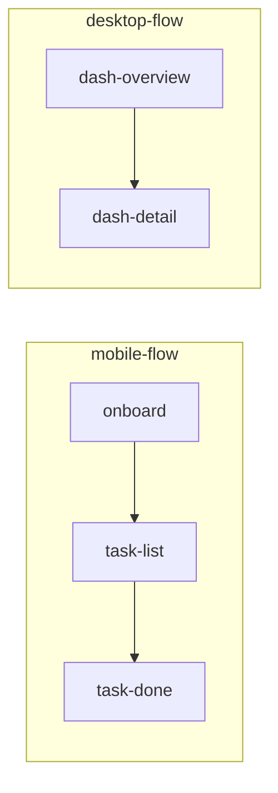

# TaskApp — Mobile + Desktop flows

## Set the scene

This spec covers two flows: the **mobile onboarding** (3 frames) and the **desktop dashboard** (2 frames). The goal is to show that the wireframe template handles both device shapes in a single doc.

**In scope:** onboarding to main task list (mobile) + team dashboard overview (desktop).
**Out of scope:** task detail, comments, integrations, notifications.

> _This is the multi-flow example — it exists to demonstrate the `device: desktop` override and multi-paragraph notes._

## Open questions for the team

- Q1 — Should the desktop dashboard be a separate product surface, or the same app with a responsive layout?
- Q2 — On mobile, should we show an inbox view (all tasks) or a today-only view on first load?

## Stream → screens



## Mobile flow

### Frame: Onboarding
key: onboard

Scene: First launch. App asks for a workspace name before anything else.

```ascii
                                  
  TASKAPP                         
  ════════════════════════════════
                                  
                                  
  Set up your workspace           
                                  
  A workspace keeps one           
  team's tasks together in        
  a single shared place.          
                                  
                                  
                                  
  WORKSPACE NAME                  
                                  
  ┌──────────────────────────────┐
  │ Acme                         │
  └──────────────────────────────┘
                                  
  This is the label you'll        
  see across the app. You         
  can rename it later in          
  Settings.                       
                                  
                                  
                                  
  ┌──────────────────────────────┐
  │      ▸  CREATE WORKSPACE     │
  └──────────────────────────────┘
                                  
  No email or account             
  needed yet.                     
                                  
                                  
                                  
  ────────────────────────────────
  STEP 1 OF 1  ·  ONBOARDING      
                                  
                                  
```

**Notes:**
- Workspace name is used throughout as context label
- No email or account required at this step
- **Critical:** name must be editable later from settings — confirm before committing to schema

### Frame: Task list
key: task-list

Scene: Empty workspace. User sees the inbox — no tasks yet.

```ascii
                                  
  ACME · INBOX                    
  ════════════════════════════════
                                  
                                  
                                  
  TODAY                           
  ·  Nothing due today            
                                  
  UPCOMING                        
  ·  Nothing scheduled            
                                  
                                  
                                  
                                  
             📋                   
                                  
                                  
                                  
  YOUR INBOX IS EMPTY             
                                  
  Add your first task — it        
  shows up here, sorted by        
  due date.                       
                                  
                                  
                                  
                                  
  ┌──────────────────────────────┐
  │       ➕  ADD A TASK         │
  └──────────────────────────────┘
                                  
  Tip: swipe a task to            
  complete it.                    
                                  
                                  
                                  
  ────────────────────────────────
  📥 Inbox   🗓 Today   👤 Me     
                                  
                                  
```

**Notes:**
- Inbox = all undone tasks, sorted by due date
- Empty state copy should be warm, not clinical
- Swipe-to-complete should be available on each task row

### Frame: Task complete
key: task-done

Scene: User completes their first task. **Celebration moment.**

```ascii
                                  
  ACME · INBOX                    
  ════════════════════════════════
                                  
                                  
                                  
             ✅                   
                                  
  FIRST TASK DONE                 
  Keep going.                     
                                  
                                  
                                  
  PROGRESS TODAY                  
  ██████░░░░░░░░░░░░  1 of 4      
                                  
                                  
                                  
  ┌──────────────────────────────┐
  │ ✓  Write the project brief  │
  │    done just now             │
  └──────────────────────────────┘
                                  
  UP NEXT                         
  ┌──────────────────────────────┐
  │ ☐  Share with the team      │
  │    due tomorrow              │
  └──────────────────────────────┘
                                  
                                  
                                  
  ┌──────────────────────────────┐
  │      ➕  ADD ANOTHER         │
  └──────────────────────────────┘
                                  
                                  
                                  
  ────────────────────────────────
  📥 Inbox   🗓 Today   👤 Me     
                                  
                                  
```

**Notes:**
- Confetti animation on first completion only — don't spam on every task
- "Keep going" copy is intentional: progressive momentum pattern
- After 5 completions, prompt to invite a teammate

## Desktop flow

### Frame: Dashboard overview
key: dash-overview
device: desktop

Scene: Team lead opens TaskApp on their laptop. **Full team workload at a glance.**

```ascii
  📋 TaskApp · Acme workspace        Dashboard / Team overview        👤 Lead ▾      [ + New task ] 
  ──────────────────────────────────────────────────────────────────────────────────────────────────
                                                                                                    
  ┌────────────────────┐  ┌────────────────────┐  ┌────────────────────┐  ┌────────────────────┐    
  │   📥 Open          │  │   ⏰ Due today      │  │   ⚠️ Overdue       │  │   ✅ Done · 7d     │    
  │   21               │  │   6                │  │   2                │  │   48               │    
  │   ▲ 4 today        │  │   across team      │  │   oldest 8 days    │  │   ▲ 8% vs wk       │    
  └────────────────────┘  └────────────────────┘  └────────────────────┘  └────────────────────┘    
                                                                                                    
  Team workload                                                                                     
  ┌────────────────────────────┐   ┌────────────────────────────┐   ┌────────────────────────────┐  
  │  Alex                      │   │  Jordan                    │   │  Sam                       │  
  │  3 open  ·  2 due          │   │  7 open  ·  0 due          │   │  1 open  ·  1 due          │  
  │  ███░░░░░░░░  light        │   │  ████████████  heavy       │   │  █░░░░░░░░░░  light        │  
  └────────────────────────────┘   └────────────────────────────┘   └────────────────────────────┘  
                                                                                                    
  Overdue (2)                                                                                       
  •  Jordan    Q2 report ....................................   due 2026-05-08    ·   8 days        
  •  Alex      Client proposal .............................    due 2026-05-09    ·   7 days        
                                                                                                    
  By member          Open    Due    Overdue    Done 7d    Load                                      
  ──────────────────────────────────────────────────────────────────────────────────────────────────
  Alex                  3      2        0         14       ███░░░░░                                 
  Jordan                7      0        1         12       ████████                                 
  Sam                   1      1        0          9       █░░░░░░░                                 
  Casey                 4      1        1         13       ████░░░░                                 
  ──────────────────────────────────────────────────────────────────────────────────────────────────
  Team                 15      4        2         48                                                
  ──────────────────────────────────────────────────────────────────────────────────────────────────
  Updated 12:41 · auto-refresh 60s              [ Export CSV ]   [ Manage team ]   [ + New task ]   
```

**Notes:**
- `device: desktop` makes this frame 1200px wide in the canvas strip
- Three-column layout: one card per team member
- Overdue section is a sorted list, oldest first
- **Critical:** is "overdue" calculated server-side or client-side?

### Frame: Dashboard detail
key: dash-detail
device: desktop

Scene: Team lead clicks Jordan's card. **Full task list for one person.**

```ascii
  ‹ Dashboard        Jordan — 7 open tasks        Member of Acme         [ + Assign to Jordan ]     
  ──────────────────────────────────────────────────────────────────────────────────────────────────
                                                                                                    
                                                                                                    
  ┌────────────────────┐  ┌────────────────────┐  ┌────────────────────┐  ┌────────────────────┐    
  │   📂 Open          │  │   ⚠️ Overdue       │  │   🗓️ Due · 7d      │  │   ✅ Done · 7d     │    
  │   7                │  │   1                │  │   3                │  │   12               │    
  │   2 high priority  │  │   Q2 report        │  │   this week        │  │   ▲ vs prev wk     │    
  └────────────────────┘  └────────────────────┘  └────────────────────┘  └────────────────────┘    
                                                                                                    
                                                                                                    
                                                                                                    
  Tasks  ·  sorted: overdue first, then due date ascending, then no-date                            
  Task                                 Status        Due           Priority    Age                  
  ──────────────────────────────────────────────────────────────────────────────────────────────────
  Q2 report                            ⚠ OVERDUE     2026-05-08    High         8d                 
  Finalize launch deck                 Open          2026-05-12    High         2d                  
  Review pull request                  Open          2026-05-11    Medium       3d                  
  Update the roadmap                   Open          2026-05-15    Medium       1d                  
  Brief the client                     Open          2026-05-16    Medium       0d                  
  Triage the support inbox             Open          2026-05-18    Low          0d                  
  Call the vendor                      Open          no due        Low          —                   
  ──────────────────────────────────────────────────────────────────────────────────────────────────
  7 tasks  ·  1 overdue  ·  next due 2026-05-08                                                     
                                                                                                    
                                                                                                    
  Recent activity                                                                                   
  09:02  Q2 report flagged late              11:20  launch deck moved to review                     
  14:05  roadmap reassigned to Jordan        16:30  vendor call rescheduled                         
  ──────────────────────────────────────────────────────────────────────────────────────────────────
  Tap a row to open the slide-over detail (mobile-safe)      [ Export ]   [ + Add task for Jordan ] 
```

**Notes:**
- Sorted: overdue first (with ⚠️), then by due date ascending, then no-date at bottom
- Clicking a task opens a slide-over detail panel (not a full page nav — back-compat with mobile)
- "Add task for Jordan" pre-fills the assignee field

> This is a multi-paragraph notes example. Notes support blockquotes, code spans, nested lists — the full Markdown spec.
> Use this for long-form review comments or multi-step decision trees.
