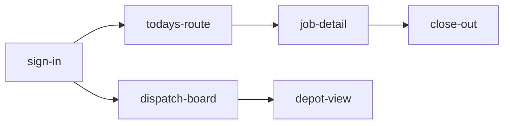

# FieldPilot — Job Dispatch & Field App

## Set the scene

**FieldPilot** coordinates a small fleet of field technicians: a dispatcher
assigns jobs from a desktop console, and each technician runs their day from a
phone. One technician can be in the field while their lead reviews the board on
a tablet at the depot.

This deck walks two journeys:

1. **Technician day** (phone) — sign in → see today's route → open a job →
   capture the work → close it out.
2. **Dispatch console** (desktop + tablet) — the dispatcher's live board and
   the depot lead's at-a-glance view.

**In scope:** auth + role routing, the technician job loop, the dispatch
board, the depot read-only view.
**Out of scope:** billing, customer notifications, parts inventory, and the
admin/settings area — all deferred past this review.

> _Sample data only — technician names, addresses, and job numbers are
> illustrative. The point of this round is the **flow and the screen
> structure**, not copy or visual design._

## Open questions for the team

- 🟢 **Q1 — Landing screen.** After sign-in a technician lands on **Today's
  route**. Is the route list the right home, or should an in-progress job
  jump straight back to the job screen?
- ⏱️ **Q2 — Arrival proof.** `job-detail` has an **Arrived** action. Do we
  need GPS/time-stamp proof of arrival for v1, or is a manual tap enough?
- 🔀 **Q3 — Dispatch default.** On the desktop board, should a new job
  **auto-suggest** the nearest free tech, or always wait for a manual assign?
- 🔄 **Q4 — Depot view refresh.** Does the tablet depot board need live
  auto-refresh, or is a pull-to-refresh acceptable for the first cut?

## Stream → screens



```flow Entry & role routing
sign-in (email + 6-digit code)
        │
        ▼
  Code verified?
  ├─ no  → stay on sign-in, show "code expired" → #frame-sign-in
  └─ yes → load profile, branch on role
           │
           ▼
     What is this account's role?
     ├─ technician → Today's route (their jobs only) → #frame-todays-route
     ├─ dispatcher → Dispatch board (full fleet)      → #frame-dispatch-board
     └─ depot lead → Depot view (read-only board)     → #frame-depot-view
                     (no assign / no edit — view only)
```

## Technician day

```flow Job state — what the tech can do
job opened from Today's route
        │
        ▼
  Has the tech tapped "Arrived"?
  ├─ no  → only [ Navigate ] + [ Arrived ] are live
  └─ yes → unlock work: photos, notes, parts, signature
           │
           ▼
     Is required proof captured?
     (≥1 photo AND customer signature)
     ├─ no  → [ Close job ] stays disabled
     └─ yes → [ Close job ] enabled → Close-out → #frame-close-out
```

### Frame: Sign in
key: sign-in
device: phone

Scene: **One screen, one job — get the right person in.** Email plus a 6-digit code; no passwords in the field.

```ascii
                                            
                                            
                                            
                                            
                                            
                                            
                                            
                ◆  FieldPilot               
              Job dispatch & field          
                                            
                                            
                                            
  ════════════════════════════════════════  
                                            
                                            
                                            
  Work email                                
  ┌──────────────────────────────────────┐  
  │ r.okeke@northfield.example           │  
  └──────────────────────────────────────┘  
                                            
                                            
                                            
  6-digit code        ( sent to +44 •••891 )
  ┌──────────────────────────────────────┐  
  │  4   1   9   2   0   _                │  
  └──────────────────────────────────────┘  
                                            
                                            
  ⚠️ That code expired — resend a new one.  
                                            
        ⏳ Resend code in 0:24               
                                            
                                            
                                            
                                            
                                            
                                            
                                            
                                            
                                            
  ┌──────────────────────────────────────┐  
  │            Verify & sign in           │  
  └──────────────────────────────────────┘  
                                            
            Trouble signing in?             
                                            
  This device:  Van 12 tablet · last       
  signed in by Rashid O. · 08:12            
                                            
                                            
                                            
  ──────────────────────────────────────    
   ◆ FieldPilot          v1 · field build   
```

**Notes:**

- Passwordless on purpose — techs are gloved, outdoors, on shared devices.
  The flow is `POST /auth/request-code` → `POST /auth/verify`.
- The screenshot shows the **error state** for Q-context: code expired, with
  a live resend cooldown (`0:24`). Happy path skips the warning line.
- **`Verify & sign in`** is the only primary action and sits low so it is
  thumb-reachable; everything above is input.
- After verify, routing is **not** the tech's choice — see the deck-level
  _Entry & role routing_ card. This screen never branches by itself.

> Q2 lives downstream, but note here: identity is per-person, so any
> arrival proof we add later is already attributable.

### Frame: Today's route
key: todays-route
device: phone

Scene: The technician's home after sign-in — **the day as an ordered list of stops**, current job pinned at top.

```ascii
  ‹                 Tue 19 May            ⚙ 
══════════════════════════════════════════ 
  Rashid O.   ·   Van 12   ·   North zone   
                                            
  Today           4 jobs · 1 done · ~5h     
  ███████░░░░░░░░░░░░░░░░░░░░░░░░   1 / 4    
  On track · next due 10:15 · 0:35 to spare 
                                            
  ┌──────────────────────────────────────┐  
  │  🗺   route map                       │  
  │      ① ─── ② ─── ③ ─── ④   ~9.4 mi   │  
  │      depot · Almond · Oak · Birch     │  
  │      [ Open in maps ]                 │  
  └──────────────────────────────────────┘  
────────────────────────────────────────── 
  ▸ NOW · 09:40                              
  ┌────────────────────────────────────┐    
  │ #4821   Boiler won't ignite        │    
  │ 14 Almond Way, Northfield NF3      │    
  │ ⏱ due 10:15   ·  0.4 mi  · ~45 min │    
  │ ( HIGH )                ( EN ROUTE )│    
  │ [ Open job ]        [ 🧭 Navigate ] │    
  └────────────────────────────────────┘    
                                            
  UP NEXT  ───────────────────────────────  
                                            
  • 11:00   #4824   No hot water             
            28 Oak Rise ········· 1.2 mi    
            Med · ~40 min · arrive ~10:55   
                                            
  • 13:15   #4830   Leak under sink          
            5 Birch Court ······· 2.0 mi    
            Med · ~30 min · arrive ~13:05   
                                            
  • 15:00   #4836   Annual service           
            90 Cedar Sq ·········· 3.4 mi   
            Low · ~50 min · arrive ~14:50   
                                            
  DONE  ──────────────────────────────────  
  • 08:30   #4815   Radiator bleed     ✅    
            Closed 09:05 · signed           
                                            
  ┌────────────────────────────────────┐    
  │ 💬 Depot                    ( 1 )  │    
  │ "Parts for #4830 are on Van 12 —   │    
  │  rear shelf." — Dana, 09:20        │    
  └────────────────────────────────────┘    
                                            
                                            
                                            
────────────────────────────────────────── 
  🗺 Route     📋 Jobs     💬 Depot    👤 Me 
```

**Notes:**

- The list **is** the route — ordered by scheduled time, current stop pinned
  with a `▸ NOW` marker and an `EN ROUTE` pill. This is the Q1 candidate
  home screen.
- Progress bar + `1 / 4` give the dispatcher-relevant "is the day on track"
  read without opening anything.
- Tapping **`Open job`** goes to `job-detail` for `#4821`. Up-next rows are
  tap-targets too but lead with time so the order is unambiguous.
- Bottom tab bar is the app's spine: `Route` (here), `Jobs`, `Depot`
  (message thread), `Me`. It sits on the bottom edge — `Route` is active.

> **Q1:** if `#4821` is already in progress, should the app deep-link back
> into the job instead of showing this list? Leaning yes for a returning
> session, no for a fresh sign-in.

### Frame: Job detail
key: job-detail
device: phone

Scene: One job, everything the tech needs on site. **Work is locked until `Arrived` is tapped** (see the flow card above).

```ascii
  ‹ Route           Job #4821           ⋯  
══════════════════════════════════════════ 
  Boiler won't ignite           ( HIGH )    
  14 Almond Way, Northfield NF3 2Q2         
  Contact · J. Bauer · 📞 tap to call       
  ⏱ Due 10:15    ·    SLA: 35 min left      
  ███████████████████████░░░░░░░  65% gone  
────────────────────────────────────────── 
  ┌─────────────────┐  ┌─────────────────┐  
  │   🧭 Navigate    │  │   ✓  Arrived    │  
  └─────────────────┘  └─────────────────┘  
                                            
  Reported fault                             
  Boiler locks out on ignition, no error    
  code on the display. Intermittent since   
  Monday, worse from cold.                   
                                            
  Asset    Combi boiler · Vaillant ecoTEC   
           installed 2019 · serial …4471    
  History  2 prior visits at this address   
           last: 14 Mar — pump replaced     
  Files    📎 2 photos from customer         
  Access   Side gate, code 4471 · dog in    
           garden — call on arrival          
  Customer Prefers a call before knocking   
                                            
  ─────  WORK   ( unlocks after Arrived ) ─  
                                            
  📷 Photos               0 — tap to add    
  📝 Work notes           empty             
  🔧 Parts used           none added        
  ✍ Customer signature    not captured      
  📋 Safety check          not started      
                                            
  ┌────────────────────────────────────┐    
  │ Required to close:                 │    
  │   • at least 1 photo               │    
  │   • customer signature             │    
  │   • gas safety check passed        │    
  └────────────────────────────────────┘    
                                            
  Est. on site  ~45 min   ·   booked 60     
  Job updated   09:38 by dispatch            
                                            
  Nearby today  #4824 Oak Rise · 1.2 mi     
                ( same area, 11:00 )          
                                            
  Tap [ Arrived ] when you reach the door    
  to start the work timer.                   
                                            
                                            
────────────────────────────────────────── 
  ⛔ Close job — locked         [ On hold ] 
```

**Notes:**

- The two big buttons (`Navigate`, `Arrived`) are the **only** live controls
  before arrival — this matches the _Job state_ flow card exactly.
- The `WORK` group is intentionally shown **locked** (muted) in this
  screenshot so the gate is visible. After `Arrived`, those four rows become
  tappable and `Close job` switches from `⛔ locked` to enabled.
- `Required to close: 1 photo + signature` is stated on-screen so the tech
  knows the exit criteria before starting.
- `On hold` is the escape hatch (parts missing, customer absent) — kept
  secondary, bottom-right, next to the disabled primary.

> **Q2:** `Arrived` is a plain tap today. Do we capture GPS + timestamp here
> for proof-of-attendance, or trust the tap for v1?

### Frame: Close-out
key: close-out
device: phone

Scene: The exit screen — **confirm the work, capture proof, close the job**. Only reachable once the required proof exists.

```ascii
  ‹ Job #4821        Close out           ✕ 
══════════════════════════════════════════ 
  Boiler won't ignite                       
  14 Almond Way · Rashid O. · Van 12        
  Time on site   09:48 → 10:31   ( 43 min ) 
────────────────────────────────────────── 
  Outcome                                    
  (•) Fixed on site                          
  ( ) Follow-up needed                       
  ( ) Could not complete                     
                                            
  Proof captured                             
  ┌────────────────────────────────────┐    
  │ ✅ Photos               3 attached  │    
  │ ✅ Customer signature   J. Bauer    │    
  │ ✅ Safety check         passed      │    
  └────────────────────────────────────┘    
                                            
  📝 Work notes                              
     "Replaced ignition electrode,           
      cleared lockout fault, ran two         
      full ignition cycles — stable."        
                                            
  🔧 Parts used                              
     • Ignition electrode  ×1                
     • Sealing washer      ×2                
                                            
  💳 Job summary                              
     Labour      0.75 h                      
     Parts        2 items                    
     Billing     to account · NF-3391        
                                            
  ✍ Customer sign-off                        
  ┌────────────────────────────────────┐    
  │   J. Bauer                  10:30   │    
  └────────────────────────────────────┘    
                                            
  Follow-up?   [ none ▾ ]                    
                                            
  On close                                   
  • job marked Fixed, customer emailed       
  • parts deducted from Van 12 stock         
  • route advances to the next stop          
                                            
  Next stop  ·  #4824  No hot water  11:00   
                                            
                                            
                                            
────────────────────────────────────────── 
  ┌────────────────────────────────────┐    
  │       Close job & go to next       │    
  └────────────────────────────────────┘    
```

**Notes:**

- This screen is **only reachable** when the gate in the _Job state_ flow
  card passes: `≥1 photo AND signature`. Both show `✅` here.
- Outcome is a single required choice (`Fixed on site` selected). `Could not
  complete` would branch to a reason prompt (out of scope this round).
- The summary is read-only confirmation — the tech captured photos/notes on
  `job-detail`; this screen is the **review + commit**, not re-entry.
- **`Close job & go to next`** does two things deliberately: closes `#4821`
  and routes to the next stop (`#4824`), returning the tech to the day loop.
  It sits on the bottom edge as the single primary action.

> Should "go to next" be automatic, or should closing return to **Today's
> route** so the tech picks? Tied to the Q1 landing decision.

## Dispatch console

```flow Assign decision (dispatcher)
unassigned job selected on the board
        │
        ▼
  Is auto-suggest ON?
  ├─ no  → dispatcher picks a tech manually from [ Assign ▾ ]
  └─ yes → compute nearest free tech (distance + next free slot)
           │
           ▼
     Dispatcher accepts the suggestion?
     ├─ yes → assign + drop onto that tech's timeline
     └─ no  → [ Pick another ▾ ] → manual choose, then assign
```

### Frame: Dispatch board
key: dispatch-board
device: desktop

Scene: The dispatcher's command screen — **every tech, every open job, one view**. Unassigned column on the left, fleet timeline on the right.

```ascii
  ◆ FieldPilot Dispatch      Board · Tue 19 May      North + East zones       🔔 3      👤 Dana K. ▾   
═══════════════════════════════════════════════════════════════════════════════════════════════════════
  Open 18      Unassigned 5      Breaching SLA 2      Techs on shift 6 / 7              [ + New job ]   
                                                                                                       
  ┌ UNASSIGNED (5) ───────────────┐   ┌ FLEET TIMELINE ─────────────────────────────────────────────┐ 
  │ #4842  No heat — full house   │   │         09:00    11:00    13:00    15:00    17:00            │ 
  │  ⚠ SLA 0:25  · East · ~50m    │   │ Rashid   [#4821][#4824]  [#4830]   [#4836]    ·             │ 
  │  [ Assign ▾ ]  nearest: Mei   │   │ Mei H.   [#4822 ]  [#4828 ]  [ free ]   [#4839]             │ 
  │ ─────────────────────────────  │   │ Tom A.   [#4823]   [#4831 ]  [ free ]   [ free ]           │ 
  │ #4845  Thermostat fault       │   │ Priya R  [#4826  ][#4833] [#4840 ]   ·                      │ 
  │  SLA 2:10  · North · ~30m     │   │ Sam O.   [ off ]   [#4829 ]  [#4835]    [#4841]             │ 
  │  [ Assign ▾ ]  nearest: Tom   │   │ Lena V.  [#4827][#4834] [ free ]  [#4838 ]    ·             │ 
  │ ─────────────────────────────  │   └─────────────────────────────────────────────────────────────┘ 
  │ #4849  Annual service         │                                                                   
  │  SLA 6:00  · North · ~30m     │   ┌ JOB DETAIL · #4842 ─────────────────────────────────────────┐ 
  │  [ Assign ▾ ]  nearest: Lena  │   │ No heat — full house        Priority HIGH    SLA 0:25 ⚠      │ 
  │ ─────────────────────────────  │   │ 7 Maple Drive, East zone    Reported 09:05 by call         │ 
  │ #4851  Booster pump noise     │   │ Suggested: Mei H.  ·  0.8 mi  ·  next free 11:00            │ 
  │  SLA 3:30  · East  · ~40m     │   │ [ Assign Mei ]  [ Pick another ▾ ]  [ Hold ]  [ Cancel ]    │ 
  │  [ Assign ▾ ]  nearest: Sam   │   └─────────────────────────────────────────────────────────────┘ 
  │ ─────────────────────────────  │                                                                   
  │ #4853  Quote follow-up        │   ┌ ACTIVITY ───────────────────────────────────────────────────┐ 
  │  SLA 8:00  · North · ~20m     │   │ 10:28  Rashid marked #4821 EN ROUTE                         │ 
  │  [ Assign ▾ ]  nearest: Lena  │   │ 10:19  #4842 created from inbound call (East)               │ 
  │ ─────────────────────────────  │   │ 10:05  Lena closed #4827  ·  signed                        │ 
  │ Drag a job onto a tech, or    │   │ 09:52  Tom assigned #4831 (manual)                          │ 
  │ use [ Assign ▾ ] to confirm   │   └─────────────────────────────────────────────────────────────┘ 
  └───────────────────────────────┘   Showing 6 of 7 techs  ·  18 open  ·  auto-suggest: ON           
                                                                                                       
                                                                                                       
═══════════════════════════════════════════════════════════════════════════════════════════════════════
  Selected: #4842    ·    [ Assign suggested ]    [ Reassign ]    [ Hold ]         [ ⟳ Refresh board ] 
```

**Notes:**

- Three-region console: **KPI strip** on top, **unassigned queue** (left) +
  **fleet timeline** (right) as the body, **action bar** pinned to the
  bottom edge. The selected job (`#4842`) drives the detail panel.
- The timeline is the dispatcher's real value — who is free *when*. Free
  slots are explicit (`[ free ]`) so a gap is findable at a glance.
- **Q3 lives here:** `auto-suggest: ON` surfaces a nearest-tech
  recommendation (`Suggested: Mei H.`) but never assigns automatically — the
  dispatcher confirms with `Assign Mei`. This is the _Assign decision_ flow
  card made visible.
- `GET /board?zone=north,east` — server-paginated; `Refresh board` is manual
  pending the Q4 decision on live updates.

> If auto-suggest is wrong often, the `Pick another ▾` path must be one
> click, not buried — worth watching in the prototype.

### Frame: Depot view
key: depot-view
device: tablet

Scene: The depot lead's wall display — **read-only**. No assign, no edit; a calm at-a-glance "is the day on track" board for the team room.

```ascii
  ◆ FieldPilot · Depot board              Tue 19 May · 10:31       🔒 View only        
══════════════════════════════════════════════════════════════════════════════════════
  North + East zones          Auto-refresh: OFF  ·  pull to refresh                     
                                                                                       
  ┌ TODAY AT A GLANCE ────────────────────────────────────────────────────────────────┐
  │                                                                                    │
  │   Open 18      Done 22      On time 81%      Breaching SLA 2      Shift 6 / 7       │
  │                                                                                    │
  │   Day progress   ███████████████░░░░░░░░░░░░░░░░░░░░░░░░░░░    22 / 40 jobs        │
  │                                                                                    │
  └────────────────────────────────────────────────────────────────────────────────────┘
                                                                                       
  ┌ BY ZONE ──────────────────────────────────────────────────────────────────────────┐
  │   North    open 11    breaching 1    techs 4    ████████████░░░░░░   on time 84%   │
  │   East     open  7    breaching 1    techs 2    ██████████░░░░░░░░   on time 76%   │
  └────────────────────────────────────────────────────────────────────────────────────┘
                                                                                       
  ┌ TECHNICIANS ──────────────────────────────────────────────────────────────────────┐
  │   Tech       Now           Next        Done  Hrs   Status                          │
  │   ───────────────────────────────────────────────────────────────────────────────  │
  │   Rashid O.  #4821 09:40   #4824 11:00   4   5.0   🟢 On route — Almond Way        │
  │   Mei H.     #4828 10:10   #4839 15:00   5   6.5   🟢 On site — Maple Drive        │
  │   Tom A.     #4831 10:00   free  13:00   3   4.0   🟡 Free from 13:00              │
  │   Priya R.   #4833 10:20   #4840 13:00   6   6.0   🟢 On route — Oak Rise          │
  │   Sam O.     #4829 11:00   #4835 13:00   2   3.5   ⚠️ SLA risk — due 11:05         │
  │   Lena V.    #4834 09:50   #4838 15:00   4   5.5   🟢 On site — Cedar Sq           │
  │   Dev N.     —     off      —    —        0    —    ⛔ Off shift today             │
  └────────────────────────────────────────────────────────────────────────────────────┘
                                                                                       
  ┌ NEEDS ATTENTION ──────────────────────────────────────────────────────────────────┐
  │   ⚠️  #4842  No heat — full house    UNASSIGNED · SLA 0:25   → dispatcher to assign │
  │   ⚠️  #4829  Boiler service          Sam O. · due 11:05      → tight, watch        │
  │   🟡  #4836  Annual service          Rashid · 15:00          → low priority        │
  └────────────────────────────────────────────────────────────────────────────────────┘
                                                                                       
  ┌ SLA WINDOW · NEXT 2 HOURS ────────────────────────────────────────────────────────┐
  │            10:30      11:00      11:30      12:00      12:30                        │
  │   #4842    ▓▓▓▓ due 0:25 ⚠                                                          │
  │   #4829      ░░░░░░ due 11:05 ⚠                                                     │
  │   #4824            ░░░░░░░░░ due 11:00                                              │
  │   #4831                    ░░░░░░ due 11:40                                         │
  │   legend   ▓ breaching soon   ░ on track                                            │
  └────────────────────────────────────────────────────────────────────────────────────┘
                                                                                       
  ┌ RECENTLY CLOSED ──────────────────────────────────────────────────────────────────┐
  │   10:05   #4827   Pump replacement      Lena V.     ·  signed                      │
  │   09:48   #4822   Thermostat reset      Mei H.      ·  signed                      │
  │   09:31   #4818   No hot water          Priya R.    ·  signed                      │
  │   09:05   #4815   Radiator bleed        Rashid O.   ·  signed                      │
  │   08:40   #4811   Boiler service        Tom A.      ·  signed                      │
  └────────────────────────────────────────────────────────────────────────────────────┘
                                                                                       
  Refreshed manually · auto-refresh OFF (Q4) · data as of 10:31                        
                                                                                       
                                                                                       
                                                                                       
══════════════════════════════════════════════════════════════════════════════════════
  🔒 View only · ask the dispatcher to assign     Last updated 10:31  ·  [ ⟳ Refresh ] 
```

**Notes:**

- This is the **depot lead role** from the deck-level _Entry & role routing_
  card: same data as the dispatch board, but **no assign / no edit** — every
  control is a status, not an action.
- Three calm panels: **glance KPIs**, the **technician roster** (now / next /
  status), and a short **needs-attention** list. No timeline grid — the lead
  needs reassurance, not controls.
- The only interactive affordance is `Pull to refresh` (bottom-right, on the
  edge) — which is exactly **Q4**: is manual refresh enough for a wall
  display, or does this need live updates?
- `🔒 View only` is stated twice (top-right and bottom-left) so nobody
  mistakes this for the dispatcher's board.

> Does the depot lead also need a per-zone filter, or is the whole-fleet
> view always what a depot room wants? Defaulting to whole-fleet for v1.
