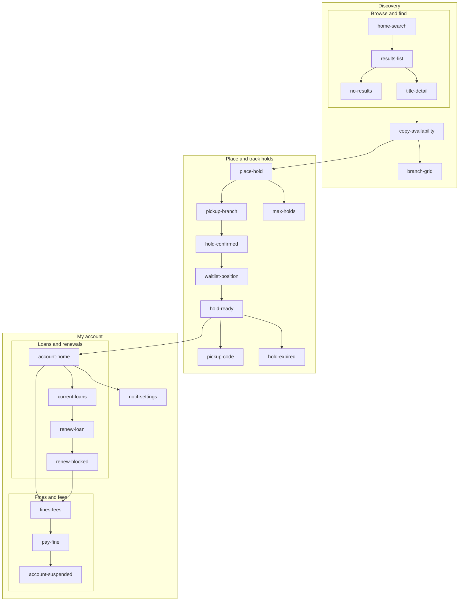

# Stacks — Library Holds and Pickup

## Set the scene

This spec covers the **public-library hold-and-pickup app** — how a patron finds a title in the branch catalog, places a hold, tracks their place in the queue, and collects the item once it is ready. It also covers the account side: current loans, renewals, fines, and notification settings.

**In scope:** catalog search, holds, pickup, loans, renewals, fines, notification settings.
**Out of scope:** e-book lending, inter-library loan from other systems, librarian/admin tooling, payment-processor internals.

> _This is the renderer stress-test example. It exists to exercise the full pipeline: 22 frames, 3 flows, nested Mermaid subgraphs, every Markdown element in reviewer notes, and four device shapes (phone, desktop, tablet, and a custom viewport)._

## Open questions for the team

- **Q1** — When every copy is out, do we show an estimated wait, or only the queue length? This is the `copy-availability` frame.
- **Q2** — Should a patron with an unpaid fine be blocked from placing _new_ holds, or only from borrowing? This changes `place-hold` and `account-suspended`.
- **Q3** — Pickup window: is 3 days the right default before a ready hold expires and passes to the next person?
- **Q4** — Do we need the desktop "availability across all branches" view in v1, or is it a fast-follow?

## Stream -> screens



## Discovery — find a title

### Frame: Home and search
key: home-search

Scene: Patron opens the app. **Search is the first thing they see.**

```ascii
                                  
  STACKS                          
  ════════════════════════════════
                                  
                                  
  Find your next read             
                                  
                                  
                                  
  ┌──────────────────────────────┐
  │ 🔍  title, author, ISBN      │
  └──────────────────────────────┘
                                  
                                  
  BROWSE                          
  [ Fiction ]   [ Kids   ]        
  [ Audio   ]   [ New    ]        
  [ Mystery ]   [ Local  ]        
                                  
                                  
                                  
  RECENT                          
  ·  tide pools                   
  ·  coastal ecology              
  ·  M. Reyes                     
                                  
                                  
  ─ YOUR BRANCH ──────────────────
  📍 Riverside    open till 8 pm  
     Hold shelf   ·   3 ready     
                                  
                                  
                                  
  HELP                            
  ·  How holds work          ›    
  ·  Find my card number     ›    
                                  
                                  
  ────────────────────────────────
  🔍 Search   📚 Holds   👤 Me    
                                  
```

**Notes:**
- The field accepts title, author, or ISBN. Backend: existing catalog API, `GET /catalog/search`.
- "Your branch" comes from the patron's saved home branch; tap to change it.
- _Copy question:_ is "Find your next read" too cute for a civic service? Alternative: "Search the catalog".
- First-time help: [How holds work](https://example.com/help/holds).

### Frame: Search results
key: results-list

Scene: A query returned several matches.

```ascii
                                  
  ‹ Back   "tide pools"        🔍 
  ════════════════════════════════
  37 RESULTS            [ Sort ▾ ]
  [ All ] [ Books ] [ Audio ]     
                                  
                                  
                                  
                                  
                                  
                                  
  ┌──────────────────────────────┐
  │ The Tide Pool Guide          │
  │ M. Reyes · 2021              │
  │ 🟢 Available · 2 left        │
  └──────────────────────────────┘
  ┌──────────────────────────────┐
  │ Pools and Shores             │
  │ J. Okafor · 2019             │
  │ 🔴 All out · hold ok         │
  └──────────────────────────────┘
  ┌──────────────────────────────┐
  │ Coastal Field Notes          │
  │ S. Lin · 2023                │
  │ 🟢 Available                 │
  └──────────────────────────────┘
  ┌──────────────────────────────┐
  │ The Rockpool Almanac         │
  │ A. Préy · 2018               │
  │ 🟡 Due soon · queue 1        │
  └──────────────────────────────┘
                                  
                                  
                                  
                                  
                                  
                                  
  Showing 4 of 37                 
  ────────────────────────────────
  [ Filters ]        [ ‹ 1/8 › ]  
                                  
```

**Notes:**
- Each row shows a current availability marker:
  - `*` = at least one copy on shelf
  - `o` = all copies out, holds allowed
- _Sort_ defaults to relevance; _Filter_ covers format, branch, and availability.
- Tapping a row opens `title-detail`.

### Frame: No results
key: no-results

Scene: The query matched nothing.

```ascii
                                  
  ‹ Back   "tide poolz"        🔍 
  ════════════════════════════════
                                  
                                  
                                  
                                  
                                  
                                  
             (  -_-  )            
                                  
                                  
                                  
                                  
                                  
  NO TITLES MATCHED               
  "tide poolz"                    
                                  
                                  
                                  
                                  
  Did you mean                    
  ┌──────────────────────────────┐
  │ 🔍  tide pools               │
  └──────────────────────────────┘
                                  
                                  
                                  
                                  
  TRY                             
  ·  check the spelling           
  ·  use a broader term           
  ·  author last name only        
  ·  search by ISBN               
                                  
                                  
                                  
                                  
  ────────────────────────────────
  [ Clear ]      [ Browse all ]   
                                  
```

**Notes:**
> Empty states are part of the product, not an afterthought. The tone should help, never blame the patron.

- Offer a "Did you mean…" suggestion when edit distance is small (here: _tide pools_).
- Log zero-result queries to a report so collection staff can spot demand gaps.

### Frame: Title detail
key: title-detail

Scene: Patron taps a result to see the full record.

```ascii
                                  
  ‹ Back   Title                 ⤴
  ════════════════════════════════
  ┌──────────────────────────────┐
  │          │  The Tide Pool     
  │  cover   │  Guide             
  │   art    │  M. Reyes          
  │          │  ★ 4.3 · 312 pp   
  └──────────┘  2021              
                                  
                                  
  A practical guide to the        
  rocky intertidal zone,          
  with plates and an index.       
                                  
                                  
                                  
  DETAILS                         
  Format    Hardcover, eBook      
  Subjects  Marine biology        
  ISBN      978-0-00-000000-0     
                                  
                                  
                                  
  AVAILABILITY                    
  🟢 Riverside       1 copy       
  🟢 Hill Street     1 copy       
  🔴 Eastgate        queue 4      
                                  
                                  
                                  
  ┌──────────────────────────────┐
  │       ▸  PLACE A HOLD        │
  └──────────────────────────────┘
  [ All branches ]   [ ♡ Save ]  
                                  
                                  
                                  
  ────────────────────────────────
  🔍 Search   📚 Holds   👤 Me    
                                  
```

**Notes:**
A few things this frame must get right, in order:

1. Show the **nearest available copy** first, not just alphabetical branches.
2. The primary action is always _Place a hold_, even when a copy is on the shelf — patrons may still want it sent to their branch.
3. "See all branches" opens `branch-grid`, the desktop-scale view.

`GET /catalog/{id}` returns per-branch counts; cache for 60s.

### Frame: Copy availability
key: copy-availability

Scene: Patron expands the availability section.

```ascii
                                  
  ‹ Back   Availability          ⤴
  ════════════════════════════════
  The Tide Pool Guide             
  M. Reyes · 2021                 
                                  
                                  
                                  
                                  
  BRANCH          STATUS    QUEUE 
  ────────────────────────────────
  Riverside       🟢 Shelf      — 
  Hill Street     🟢 Shelf      — 
  Eastgate        🔴 Out        4 
  Northpoint      🟡 Soon       1 
  Westmoor        🟢 Shelf      — 
  Old Town        🟢 Shelf      — 
  Mobile unit     ⛔ No         — 
  ────────────────────────────────
  legend 🟢 shelf 🟡 soon         
         🔴 out   ⛔ not held     
                                  
                                  
                                  
                                  
                                  
                                  
                                  
  ─ IF YOU HOLD NOW ──────────────
  Nearest   Riverside, today      
  Eastgate  queue ~ 2 weeks       
  Estimates are approximate.      
                                  
                                  
                                  
                                  
  ┌──────────────────────────────┐
  │       ▸  PLACE A HOLD        │
  └──────────────────────────────┘
  [ Send to my branch ]           
                                  
```

**Notes:**
- This is the frame **Q1** is about: do we surface `~2 wks`, or is that a promise we cannot keep?
  - Pro: sets expectations, reduces "where is my book" contacts.
  - Con: estimate accuracy depends on average loan length, which varies by title.
- Nested decision for the team:
  - if we show an estimate:
    - label it clearly as approximate
    - never present it as a specific date
- Leads into `place-hold`.

### Frame: Availability across branches
key: branch-grid
device: desktop

Scene: The full system-wide grid. **Desktop-scale frame** — a wide table the phone cannot show.

```ascii
  📚 Stacks · The Tide Pool Guide — system availability      M. Reyes · 2021    [ ▸ Place a hold ]  
  ──────────────────────────────────────────────────────────────────────────────────────────────────
  Filters:  [ My branches ▾ ]   [ Available now ]   [ Largest queue ]   🔄 updated 12:41 · auto 60s 
                                                                                                    
                                                                                                    
                                                                                                    
                                                                                                    
  Branch           Copies   On shelf   On loan   Holds   Next due    Transit    Fastest path        
  ──────────────────────────────────────────────────────────────────────────────────────────────────
  Riverside            3        1          2        0     05-19       —          🟢 on shelf now    
  Hill Street          2        1          1        0     05-21       —          🟢 on shelf now    
  Eastgate             2        0          2        4     05-18       1 in       🔴 queue of 4      
  Northpoint           1        0          1        1     05-23       —          🟡 1 ahead of you  
  Westmoor             2        2          0        0     —           —          🟢 on shelf now    
  Lakeside             1        0          1        0     05-20       —          🟡 ~ 1 week        
  Old Town             1        1          0        0     —           —          🟢 on shelf now    
  Greenfield           2        0          2        2     05-22       —          🔴 queue of 2      
  Harbor               1        0          1        0     05-25       1 out      🟡 in transit out  
  Mobile unit          0        0          0        0     —           n/a        ⛔ not carried     
  ──────────────────────────────────────────────────────────────────────────────────────────────────
  System totals       15        5         12        7                            10 branches        
                                                                                                    
                                                                                                    
                                                                                                    
                                                                                                    
                                                                                                    
  Legend   On shelf = borrow or send now   ·   On loan = checked out   ·   Holds = patrons ahead    
           Transit  = moving between branches (in = arriving, out = leaving)   ·   — = n/a          
  Tip: copies On shelf with zero Holds is the fastest path — Westmoor and Old Town qualify.         
  ──────────────────────────────────────────────────────────────────────────────────────────────────
  Showing 10 of 10 branches in the Riverside system        [ Export CSV ]      [ ▸ Place a hold ]   
```

**Notes:**

#### Why this frame is desktop-only

A 10-branch by 7-column matrix does not fit a 280px phone frame. This frame uses `device: desktop` so reviewers can judge the **real information density** before we decide whether v1 needs it at all — that is **Q4**.

- Columns are sortable; default sort is branch name.
- "Transit" is the column most likely to confuse patrons — consider a tooltip.
- Performance: one query (`GET /catalog/{id}/system`), not ten.

## Holds — reserve and pick up

### Frame: Place a hold
key: place-hold

Scene: Patron commits to reserving the title.

```ascii
                                  
  ‹ Back   Place a hold           
  ════════════════════════════════
  The Tide Pool Guide             
  M. Reyes · 2021 · 312 pp        
                                  
                                  
                                  
                                  
  DELIVER TO                      
  ┌──────────────────────────────┐
  │ 📍 Riverside (home)       ▾  │
  └──────────────────────────────┘
  Pickup held for 3 days          
  once it is ready.               
                                  
                                  
                                  
                                  
  NOTIFY ME BY                    
  [x] Push    on this device      
  [x] Email   sam@example.com     
  [ ] SMS     add a number        
                                  
                                  
                                  
                                  
                                  
  ─ YOUR PLACE ───────────────────
  You will be      #1 in line     
  Copies in system 3              
  Estimated ready  ~ today        
                                  
                                  
                                  
                                  
  ┌──────────────────────────────┐
  │      ▸  CONFIRM HOLD         │
  └──────────────────────────────┘
  [ Cancel ]                      
                                  
```

**Notes:**
> **Q2 lives here.** If a patron has an unpaid fine, does this button disable, or do we let the hold queue and block only at checkout? The team needs to decide before build.

- Default pickup branch = the patron's home branch.
- Place-in-line is computed at confirm time, not display time, to avoid a stale number.

### Frame: Choose pickup branch
key: pickup-branch

Scene: Patron changes where the book should be sent.

```ascii
                                  
  ‹ Back   Deliver to             
  ════════════════════════════════
  Choose a pickup branch          
                                  
                                  
  ┌──────────────────────────────┐
  │ 🔍  Filter branches          │
  └──────────────────────────────┘
                                  
                                  
                                  
  NEAR YOU                        
  (•) Riverside    home · 0.4 mi  
  ( ) Hill Street       · 1.8 mi  
  ( ) Eastgate          · 3.1 mi  
  ( ) Northpoint        · 4.6 mi  
                                  
                                  
  OTHER BRANCHES                  
  ( ) Westmoor          · 5.2 mi  
  ( ) Lakeside          · 6.0 mi  
  ( ) Old Town          · 7.3 mi  
  ( ) Harbor            · 9.4 mi  
                                  
                                  
                                  
  Only branches in your           
  system are listed.              
                                  
                                  
                                  
  Selected                        
  📍 Riverside · open till 8 pm   
                                  
                                  
  ┌──────────────────────────────┐
  │     ▸  USE THIS BRANCH       │
  └──────────────────────────────┘
  [ Cancel ]                      
                                  
```

**Notes:**
- The list is ordered by distance from the patron's saved location, home branch pinned first.
- Out-of-system branches are intentionally excluded — inter-library loan is _out of scope_ for v1.
- Returns to `place-hold` with the chosen branch applied.

### Frame: Hold confirmed
key: hold-confirmed

Scene: The hold succeeded.

```ascii
                                  
                                  
                                  
                                  
                                  
               ✅                 
                                  
                                  
                                  
                                  
  HOLD PLACED                     
                                  
                                  
  ────────────────────────────────
  The Tide Pool Guide             
  M. Reyes · 2021                 
                                  
                                  
                                  
  Pickup at     Riverside         
  Your place    #1 in line        
  Est. ready    ~ today           
  Expires       3 days after      
  Confirmation  #H-4827           
  ────────────────────────────────
                                  
                                  
                                  
                                  
  We will notify you by           
  push and email when it          
  is ready to collect.            
                                  
                                  
                                  
                                  
  ┌──────────────────────────────┐
  │     ▸  VIEW MY HOLDS         │
  └──────────────────────────────┘
  [ Keep browsing ]               
                                  
```

**Notes:**
Confirmation has to answer three questions at a glance:

1. Did it work? (the OK mark plus "Hold placed")
2. Where do I pick it up? (branch)
3. Roughly how long? (place in line)

- "Keep browsing" returns to `home-search`; "View my holds" jumps to `waitlist-position`.

### Frame: Waitlist position
key: waitlist-position

Scene: Patron checks where they stand in the queue.

```ascii
                                  
  ‹ Back   My holds               
  ════════════════════════════════
  ACTIVE (2)        PAUSED (0)    
                                  
                                  
                                  
  ┌──────────────────────────────┐
  │ The Tide Pool Guide          │
  │ Riverside · ready soon       │
  │ #1 of 3                      │
  │ ████████████████░░░░         │
  │ [ Pause ]       [ Cancel ]   │
  └──────────────────────────────┘
  ┌──────────────────────────────┐
  │ Coastal Field Notes          │
  │ Hill St · ~ 3 weeks          │
  │ #5 of 9                      │
  │ ██████░░░░░░░░░░░░░░         │
  │ [ Pause ]       [ Cancel ]   │
  └──────────────────────────────┘
                                  
                                  
                                  
                                  
  HISTORY                         
  ✅ Salt and Light   May 2       
  ✅ The Long Field   Apr 9       
  ⛔ Maps of Nowhere  expired     
                                  
                                  
                                  
                                  
                                  
  Bars are illustrative only.     
                                  
                                  
                                  
  ────────────────────────────────
  🔍 Search   📚 Holds   👤 Me    
                                  
```

**Notes:**
- Position uses the form _#N of M_ where `N` is the patron's rank and `M` is the queue length — `M` gives context `N` alone cannot.
- _Pause a hold_ keeps the patron's place but skips them until they resume (the vacation case).
- The progress bar is illustrative only; never present it as a guaranteed timeline.

### Frame: Max holds reached
key: max-holds

Scene: Patron tries to place one hold too many.

```ascii
                                  
  ‹ Back   Hold not placed        
  ════════════════════════════════
                                  
                                  
                                  
                                  
                                  
               ( ! )              
                                  
                                  
                                  
                                  
                                  
  HOLD LIMIT REACHED              
                                  
                                  
  You have 10 of 10               
  active holds.                   
                                  
  ────────────────────────────────
  Active holds      10 of 10      
  Ready for pickup   1            
  In transit         2            
  ────────────────────────────────
                                  
                                  
                                  
                                  
  Cancel or pause an              
  existing hold to add a          
  new one. This is a              
  library policy limit.           
                                  
                                  
                                  
  ┌──────────────────────────────┐
  │     ▸  MANAGE MY HOLDS       │
  └──────────────────────────────┘
  [ Cancel ]                      
                                  
```

**Notes:**
> This is a guardrail, not an error the patron caused. The wording avoids "you did something wrong".

- The 10-hold ceiling is a library policy value — keep it server-configurable, not hard-coded.
- "Manage my holds" deep-links to `waitlist-position`.

### Frame: Hold ready for pickup
key: hold-ready

Scene: The book has arrived and is waiting.

```ascii
                                  
                                  
                                  
                                  
                                  
               ⭐                 
                                  
                                  
                                  
                                  
  READY FOR PICKUP                
                                  
                                  
  ────────────────────────────────
  The Tide Pool Guide             
  M. Reyes · 2021                 
                                  
  Branch    Riverside             
  Shelf     Hold shelf "REY"      
  Collect   by Mon 19 May         
  Hours     9 am – 8 pm           
  ────────────────────────────────
                                  
                                  
                                  
                                  
  ⏳  3 days left to collect       
                                  
                                  
  After that the hold             
  passes to the next              
  patron in line.                 
                                  
                                  
                                  
                                  
  ┌──────────────────────────────┐
  │     ▸  SHOW PICKUP CODE      │
  └──────────────────────────────┘
  [ I cannot make it ]            
                                  
```

**Notes:**
- This is the highest-value notification in the product. It should deep-link straight here from push or email.
- The pickup deadline (**Q3**, default 3 days) is shown as both a date and a countdown — different patrons parse each differently.
- "I cannot make it" routes to a reschedule-or-cancel choice, then to `account-home` if cancelled. Full policy: [pickup rules](https://example.com/help/pickup).

### Frame: Pickup code
key: pickup-code
device: tablet

Scene: Shown at the branch self-pickup stand. **Tablet-scale frame** — larger so it reads from a short distance.

```ascii
                                                                                
  STACKS — SELF-PICKUP                                                          
  ══════════════════════════════════════════════════════════════════════════════
                                                                                
                                                                                
  Show this to the self-pickup scanner at the hold shelf                        
                                                                                
                                                                                
                                                                                
                                                                                
                                                                                
                                                                                
          ┌────────────────────────────────────────────────────────────────────┐
          │  ║│║  ║│ ║║│ │║║ │ ║│║ ║║│ │║ ║│║║ │ ║│ ║║│ │║ ║  │                 
          │  ║│║  ║│ ║║│ │║║ │ ║│║ ║║│ │║ ║│║║ │ ║│ ║║│ │║ ║  │                 
          │  ║│║  ║│ ║║│ │║║ │ ║│║ ║║│ │║ ║│║║ │ ║│ ║║│ │║ ║  │                 
          │  ║│║  ║│ ║║│ │║║ │ ║│║ ║║│ │║ ║│║║ │ ║│ ║║│ │║ ║  │                 
          └────────────────────────────────────────────────────────────────────┘
                                                                                
                                                                                
                                                                                
                                                                                
                                                                                
                       HOLD   ·   4827 1130                                     
                                                                                
                                                                                
                                                                                
                                                                                
                                                                                
                                                                                
  Title     The Tide Pool Guide                                                 
  Author    M. Reyes                                                            
  Patron    Sam O.   ·   card ··· 4471                                          
  Branch    Riverside   ·   hold shelf "REY"                                    
  Collect   by Mon 19 May   ·   9 am – 8 pm                                     
                                                                                
                                                                                
                                                                                
                                                                                
                                                                                
  ⏳  Code refreshes in 04:58 — it expires after pickup                          
  🔒  The rotating code prevents a screenshot being reused                      
                                                                                
                                                                                
                                                                                
                                                                                
                                                                                
  ──────────────────────────────────────────────────────────────────────────────
  [ Refresh code ]                  [ Done ]   [ Ask a librarian ]              
                                                                                
```

**Notes:**
- Uses `device: tablet` because the code is often shown across a counter; the larger frame reflects real use.
- The rotating code stops a screenshot from being reused after pickup.
- Accessibility:
  - the numeric code is always shown as text under the symbol
  - the text alternative must be readable by a screen reader, not image-only

### Frame: Hold expired
key: hold-expired

Scene: The pickup window passed.

```ascii
                                  
  ‹ Back   Hold expired           
  ════════════════════════════════
                                  
                                  
                                  
                                  
                                  
               ( ⌛ )              
                                  
                                  
                                  
                                  
  HOLD EXPIRED                    
                                  
  The Tide Pool Guide was         
  not collected by the            
  deadline and has moved          
  to the next person.             
                                  
                                  
  ────────────────────────────────
  Expired on    Mon 19 May        
  Was held at   Riverside         
  Queue         reopened          
  ────────────────────────────────
                                  
                                  
                                  
  Place the hold again —          
  you re-enter at the back        
  of the line. Other holds        
  are not affected.               
                                  
                                  
                                  
  ┌──────────────────────────────┐
  │     ▸  PLACE HOLD AGAIN      │
  └──────────────────────────────┘
  [ Dismiss ]                     
                                  
```

**Notes:**
- Be honest and non-punitive: state what happened and the one consequence (back of the line).
- "Place hold again" loops to `place-hold` with the title pre-filled.
- Edge cases to handle:
  - title now has zero holdable copies, show `copy-availability` instead
  - patron already at the hold limit, show `max-holds`

## My account — loans, renewals, fines

### Frame: Account home
key: account-home

Scene: The patron's dashboard.

```ascii
                                  
  MY ACCOUNT                      
  ════════════════════════════════
  Hi, Sam                         
  Riverside · card ··· 4471       
                                  
                                  
                                  
  ┌─────────────┐ ┌─────────────┐ 
  │ 📚 LOANS    │ │ 🔖 HOLDS    │ 
  │ 3           │ │ 2           │ 
  │ 1 due soon  │ │ 1 ready ⭐  │ 
  └─────────────┘ └─────────────┘ 
  ┌─────────────┐ ┌─────────────┐ 
  │ 💳 FINES    │ │ ⚙ SETTINGS  │
  │ $2.40       │ │ Notify &    │ 
  │ pay now     │ │ account     │ 
  └─────────────┘ └─────────────┘ 
                                  
                                  
                                  
                                  
                                  
  ─ COMING UP ────────────────────
  ⭐ Ready    The Tide Pool Guide 
  ⏳ Due 18 May · Salt and Light   
  🔴 Overdue  Maps of Nowhere     
                                  
                                  
                                  
                                  
                                  
  RECENT                          
  ✅ Returned   The Quiet Shore   
  ✅ Renewed    The Long Field    
                                  
                                  
                                  
  ────────────────────────────────
  🔍 Search   📚 Holds   👤 Me    
                                  
```

**Notes:**

#### Dashboard priorities

The four tiles are ordered by how often patrons need them: **Loans** and **Holds** first, then **Fines**, then **Settings**.

- The "Next due" line is a soft nudge — tap to jump to `current-loans`.
- The Fines tile turns amber above $0.00 and red above the borrowing-block threshold.

### Frame: Current loans
key: current-loans

Scene: Everything the patron currently has out.

```ascii
                                  
  ‹ Back   Current loans (3)      
  ════════════════════════════════
  Sorted: overdue first           
                                  
                                  
                                  
  ┌──────────────────────────────┐
  │ Maps of Nowhere              │
  │ 🔴 OVERDUE 3 days · $0.90    │
  │ Renews left  0               │
  │ [ Renew ]      [ Details ]   │
  └──────────────────────────────┘
  ┌──────────────────────────────┐
  │ Salt and Light               │
  │ 🟡 Due 18 May · in 2 days    │
  │ Renews left  2               │
  │ [ Renew ]      [ Details ]   │
  └──────────────────────────────┘
  ┌──────────────────────────────┐
  │ The Long Field               │
  │ 🟢 Due 24 May · in 8 days    │
  │ Renews left  3               │
  │ [ Renew ]      [ Details ]   │
  └──────────────────────────────┘
                                  
                                  
                                  
                                  
                                  
  ─ SUMMARY ──────────────────────
  Total out  3   ·   Overdue 1    
  Due this week 1   ·   $0.90     
                                  
                                  
                                  
                                  
  ┌──────────────────────────────┐
  │    ▸  RENEW ALL ELIGIBLE     │
  └──────────────────────────────┘
                                  
```

**Notes:**
Sorting rule, in priority order:

1. Overdue items first (most urgent on top)
2. Then by due date ascending
3. Title alphabetical as the final tiebreaker

- Each row's _Renew_ goes to `renew-loan`.
- Overdue rows still allow renew unless the account is blocked.

### Frame: Renew loan
key: renew-loan

Scene: Patron renews a single item.

```ascii
                                  
  ‹ Back   Renew                  
  ════════════════════════════════
  Salt and Light                  
  M. Reyes                        
  Checked out  04 May             
                                  
                                  
  ────────────────────────────────
  Current due       18 May        
  ────────────────────────────────
                                  
                                  
                                  
  NEW DUE DATE                    
  ┌──────────────────────────────┐
  │ 01 Jun  ·  +14 days       ▾  │
  └──────────────────────────────┘
                                  
                                  
  ( ) 25 May  ·  +7 days          
  (•) 01 Jun  ·  +14 days         
  ( ) 08 Jun  ·  +21 days         
                                  
                                  
                                  
                                  
  Renewals used   1 of 3          
  ████████░░░░░░░░░░░░░░░░        
                                  
  No one else has this on         
  hold, so renewal is ok.         
                                  
                                  
                                  
                                  
  ┌──────────────────────────────┐
  │     ▸  CONFIRM RENEWAL       │
  └──────────────────────────────┘
  [ Cancel ]                      
                                  
```

**Notes:**
- A renewal is only offered when **no one else has the title on hold**. If someone does, this screen is replaced by `renew-blocked`.
- "Renewals used" makes the policy ceiling visible _before_ the patron hits it.
- The new due date is computed server-side from loan policy, not from the device clock.

### Frame: Renewal blocked
key: renew-blocked

Scene: The item cannot be renewed.

```ascii
                                  
  ‹ Back   Cannot renew           
  ════════════════════════════════
                                  
                                  
                                  
                                  
                                  
               ( ! )              
                                  
                                  
                                  
                                  
  CANNOT RENEW                    
                                  
  Salt and Light                  
                                  
                                  
  Another patron has this         
  title on hold, so it            
  cannot be renewed.              
                                  
  ────────────────────────────────
  Return by     18 May            
  To avoid      $0.30/day fine    
  Queue         2 waiting         
  ────────────────────────────────
                                  
                                  
                                  
  Returning on time keeps         
  your account in good            
  standing.                       
                                  
                                  
                                  
  ┌──────────────────────────────┐
  │   ▸  FIND A COPY ELSEWHERE   │
  └──────────────────────────────┘
  [ Set a reminder ]   [ OK ]     
                                  
```

**Notes:**
> Blocked actions must always explain _why_ and offer a next step — never a dead end.

- "Find a copy elsewhere" runs a fresh `copy-availability` lookup for the same title.
- If the return is late, this loan becomes a fine and the path continues to `fines-fees`.

### Frame: Fines and fees
key: fines-fees

Scene: The patron reviews what they owe.

```ascii
                                  
  ‹ Back   Fines and fees         
  ════════════════════════════════
                                  
                                  
  BALANCE DUE                     
                                  
                                  
                                  
        $2.40                     
                                  
                                  
  ────────────────────────────────
  ┌──────────────────────────────┐
  │ Maps of Nowhere              │
  │ Overdue · 3 days             │
  │ accruing $0.30/day    $0.90  │
  └──────────────────────────────┘
  ┌──────────────────────────────┐
  │ Tin Roof Songs               │
  │ Lost — replacement           │
  │ fixed                 $1.50  │
  └──────────────────────────────┘
                                  
                                  
  ─ HOW IT ADDS UP ───────────────
  Accruing fines        $0.90     
  Fixed fees            $1.50     
  ────────────────────────────────
  Total                 $2.40     
                                  
                                  
                                  
  Borrowing blocks above          
  $5.00. You are below it.        
                                  
                                  
  ┌──────────────────────────────┐
  │       ▸  PAY $2.40           │
  └──────────────────────────────┘
                                  
```

**Notes:**
- Two fee types, shown distinctly:
  - _accruing_ (overdue, grows daily) — show the daily rate, e.g. `$0.30/day`
  - _fixed_ (lost-item replacement) — one-time
- The borrowing-block threshold is policy-configurable; today it is `$5.00`.
- Leads to `pay-fine`.

### Frame: Pay a fine
key: pay-fine

Scene: Patron settles the balance.

```ascii
                                  
  ‹ Back   Pay                    
  ════════════════════════════════
                                  
                                  
  AMOUNT DUE                      
                                  
                                  
        $2.40                     
                                  
                                  
  ────────────────────────────────
  Maps of Nowhere  overdue  $0.90 
  Tin Roof Songs   lost     $1.50 
  ────────────────────────────────
                                  
                                  
                                  
  PAY WITH                        
  (•) Card ending 4471            
  ( ) Add a new card              
  ( ) Pay at the branch desk      
                                  
                                  
  ┌──────────────────────────────┐
  │ Card ··· 4471      exp 04/27 │
  └──────────────────────────────┘
                                  
                                  
  The server charges the          
  authoritative balance —         
  the amount is read-only.        
                                  
                                  
                                  
                                  
  ┌──────────────────────────────┐
  │       ▸  PAY $2.40           │
  └──────────────────────────────┘
  [ Cancel ]                      
                                  
```

**Notes:**
Steps the patron walks through:

1. Confirm the amount (read-only, server-authoritative)
2. Pick a saved card or add one
3. Pay; on success, return to `account-home` with the balance cleared

- **Never** trust a client-submitted amount — the server charges the authoritative balance.
- Payment-processor internals are out of scope for this wireframe.

### Frame: Account suspended
key: account-suspended

Scene: Borrowing is paused over the fine ceiling.

```ascii
                                  
  ‹ Back   Account on hold        
  ════════════════════════════════
                                  
                                  
                                  
                                  
                                  
               ( ! )              
                                  
                                  
                                  
                                  
                                  
  BORROWING PAUSED                
                                  
                                  
  Your balance is over the        
  $5.00 limit, so new loans       
  and holds are paused.           
                                  
  ────────────────────────────────
  Balance        $6.20            
  Over limit by  $1.20            
  Limit          $5.00            
  ────────────────────────────────
                                  
                                  
                                  
                                  
  ✅ Existing loans are safe      
  ✅ Your queue place is safe     
  ✅ Renewals still work          
                                  
                                  
                                  
  ┌──────────────────────────────┐
  │     ▸  PAY TO RESTORE        │
  └──────────────────────────────┘
  [ Borrowing limits ]            
                                  
```

**Notes:**
> Suspension is reversible and the screen says so immediately — anxiety reduction is the job here.

- Distinguish clearly: _new borrowing_ is paused; _existing loans_ and _queue place_ are safe.
- "Pay to restore" routes to `pay-fine`; clearing the balance lifts the block immediately.
- Policy reference: [borrowing limits](https://example.com/help/limits).

### Frame: Notification settings
key: notif-settings
device: custom 1024x1366

Scene: Where the patron tunes how Stacks contacts them. **Custom viewport** (1024x1366) — a tall settings sheet.

```ascii
                                                                                                    
  ‹ Back   Notification settings                                                  Sam O. · ··· 4471 
  ──────────────────────────────────────────────────────────────────────────────────────────────────
                                                                                                    
  CHANNELS                                  How Stacks can reach you                                
  ──────────────────────────────────────────────────────────────────────────────────────────────────
  Push           [x] on                     This device  ·  Stacks app                              
  Email          [x] on                     sam@example.com                                         
  SMS            [ ] off                    add a mobile number to enable                           
  ──────────────────────────────────────────────────────────────────────────────────────────────────
                                                                                                    
                                                                                                    
  TELL ME WHEN                                                              Push    Email    SMS    
  ──────────────────────────────────────────────────────────────────────────────────────────────────
  A hold is ready to collect                                                [x]     [x]      [ ]    
  A hold is about to expire (1 day left)                                    [x]     [x]      [ ]    
  An item is due in 2 days                                                  [x]     [x]      [ ]    
  An item is now overdue                                                    [x]     [x]      [ ]    
  A fine was added to my account                                            [ ]     [x]      [ ]    
  My place in a queue moved up                                              [ ]     [ ]      [ ]    
  A renewal succeeded or failed                                             [ ]     [x]      [ ]    
  Library news and events                                                   [ ]     [ ]      [ ]    
  ──────────────────────────────────────────────────────────────────────────────────────────────────
                                                                                                    
                                                                                                    
  QUIET HOURS                                                                                       
  ──────────────────────────────────────────────────────────────────────────────────────────────────
  ┌────────────────────────────────────────────────────────────────────────────────────────────────┐
  │  From  21:00            To  07:00            Time zone  Riverside (local)              ▾       │
  └────────────────────────────────────────────────────────────────────────────────────────────────┘
  No push or SMS during quiet hours.  "Hold ready" still sends an email.                            
  ──────────────────────────────────────────────────────────────────────────────────────────────────
                                                                                                    
                                                                                                    
  DIGEST                                                                                            
  ──────────────────────────────────────────────────────────────────────────────────────────────────
  ( ) Off — notify me item by item                                                                  
  (•) Daily   ·   one summary email at 08:00                                                        
  ( ) Weekly  ·   Monday morning                                                                    
  ──────────────────────────────────────────────────────────────────────────────────────────────────
                                                                                                    
                                                                                                    
  ⚠️ Turning every channel off means you may miss a ready hold before it expires.                   
                                                                                                    
                                                                                                    
  PREVIEW                                                                                           
  ──────────────────────────────────────────────────────────────────────────────────────────────────
  📨  "The Tide Pool Guide is ready at Riverside — collect by Mon 19 May."                          
      sent by push + email  ·  14:02  ·  this is how a notification will look                       
                                                                                                    
                                                                                                    
  ──────────────────────────────────────────────────────────────────────────────────────────────────
  [ Restore defaults ]                                          [ Cancel ]   [ ▸ Save changes ]     
                                                                                                    
```

**Notes:**
This frame uses a **custom 1024x1366 viewport** specifically to exercise the renderer's custom-device CSS path (a tall portrait shape), not because the product needs that exact size.

- Channel toggles and event toggles are independent: turning a channel off must not silently lose the per-event choices.
- "Hold ready" is intentionally hard to fully silence — it is the one message patrons regret missing.

The save payload carries channels, events, and quiet hours. A representative shape:

```json
{
  "channels": { "push": true, "email": true, "sms": false },
  "events":   { "hold_ready": true, "due_soon": true, "fine_added": false },
  "quiet_hours": { "from": "21:00", "to": "07:00" }
}
```

- Quiet hours never suppress email, only push and SMS.
- A nested rule the team should confirm:
  - if every channel is off:
    - show a warning before save
    - still allow it (some patrons truly want silence)
