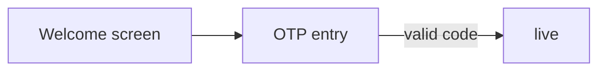

# Valid mermaid with quoted labels (Blocker 1 fix)

## Set the scene

This spec verifies that words INSIDE quoted Mermaid labels are NOT validated as frame keys.
The words "Welcome screen", "OTP entry", and "valid code" appear inside brackets/quotes
but are not frame keys. The render should PASS cleanly.

## Stream → screens



## Main flow

### Frame: Welcome screen
key: welcome

Scene: Entry point.

```ascii
┌──────────┐
│  Welcome │
└──────────┘
```

**Notes:**
- Frame key is "welcome" — label "Welcome screen" is in Mermaid brackets, should NOT be validated

### Frame: OTP entry
key: otp

Scene: OTP input.

```ascii
┌──────────┐
│  OTP     │
└──────────┘
```

**Notes:**
- Frame key is "otp" — label "OTP entry" is in Mermaid brackets, should NOT be validated
- Arrow label "valid code" should also NOT be validated

### Frame: Live
key: live

Scene: Live screen — bare node ID, no label in Mermaid.

```ascii
┌──────────┐
│  Live    │
└──────────┘
```

**Notes:**
- Frame key is "live" — appears as bare node in Mermaid, should be substituted with label
