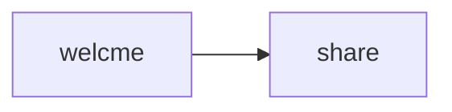

# Invalid mermaid typo

## Set the scene

This spec has a typo in the Mermaid block. The node ID "welcme" does not match any frame key.
The render should exit with error citing the unknown node ID.

## Stream → screens



## Main flow

### Frame: Welcome
key: welcome

Scene: Entry point.

```ascii
┌──────────┐
│  Welcome │
└──────────┘
```

**Notes:**
- Note: Mermaid has "welcme" (typo) instead of "welcome"

### Frame: Share
key: share

Scene: Share screen.

```ascii
┌──────────┐
│  Share   │
└──────────┘
```

**Notes:**
- This frame is referenced correctly
