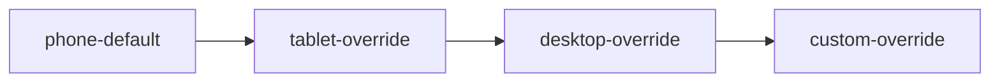

# Multi-device coverage fixture

## Set the scene

Exercises every device type the renderer supports in one deck: `phone` (via
`default_device`), plus per-frame `device:` overrides for `tablet`, `desktop`,
and `custom WxH`. Verifies the deck-default path and the per-frame override
path both reach the renderer's chrome resolution correctly.

## Stream → screens



## Coverage flow

### Frame: Phone default
key: phone-default

Scene: Phone via `default_device` — no per-frame override.

```ascii
  ‹ Back              Sign in           ⚙ 
                                          
  ──────────────────────────────────────  
                                          
  Email                                   
  ┌──────────────────────────────────┐    
  │ you@example.com                  │    
  └──────────────────────────────────┘    
                                          
  Password                                
  ┌──────────────────────────────────┐    
  │ ••••••••                         │    
  └──────────────────────────────────┘    
                                          
  [ ] Remember me                         
                                          
                                          
                                          
                                          
                                          
                                          
                                          
                                          
                                          
                                          
                                          
                                          
                                          
                                          
                                          
  ┌──────────────────────────────────┐    
  │           Sign in                │    
  └──────────────────────────────────┘    
                                          
            Forgot password?              
                                          
  ──────────────────────────────────────  
  🏠 Home   🔍 Find   🔔 Alerts   👤 Me  
```

**Notes:**
- Phone screen via `default_device: phone`; no `device:` line.
- Verifies the deck-default path.

### Frame: Tablet override
key: tablet-override
device: tablet

Scene: Tablet via per-frame `device: tablet` override — a settings list.

```ascii
  ‹ Back                            Settings                              ⚙ 
══════════════════════════════════════════════════════════════════════════ 
                                                                            
  ACCOUNT                                                                   
  ─────────────────────────────────────────────────────────────────────     
  👤 Profile                          Rashid O.                       ›     
  📧 Email                            r.okeke@example.com             ›     
  🔒 Password                         Last changed 14 Mar             ›     
  🏷  Display name                    Rashid                          ›     
                                                                            
                                                                            
  NOTIFICATIONS                                                             
  ─────────────────────────────────────────────────────────────────────     
  🔔 Push notifications               [x] on                          ›     
  📨 Email digests                    Weekly                          ›     
  ⏰ Quiet hours                      22:00 – 07:00                   ›     
                                                                            
                                                                            
  WORKSPACE                                                                 
  ─────────────────────────────────────────────────────────────────────     
  👥 Team                             Northfield · 6 members          ›     
  🗂  Default project                 Today's route                   ›     
  🌐 Language                         English (UK)                    ›     
                                                                            
                                                                            
                                                                            
                                                                            
                                                                            
                                                                            
                                                                            
                                                                            
  ──────────────────────────────────────────────────────────────────────    
                          [ Sign out of this device ]                       
```

**Notes:**
- Tablet via per-frame override (`device: tablet`).
- Verifies the override path AND tablet chrome (the small camera-dot
  status mark via CSS).

### Frame: Desktop override
key: desktop-override
device: desktop

Scene: Desktop via per-frame `device: desktop` — a dashboard.

```ascii
  ◆ Northfield Ops      Today · Tue 19 May          North + East zones        🔔 3      👤 Dana K. ▾   
══════════════════════════════════════════════════════════════════════════════════════════════════════
  Open 18      In progress 6      Done 22       On time 81%      Breaching SLA 2     [ + New job ]      
                                                                                                        
  ┌ QUEUE ─────────────────────────────┐   ┌ ACTIVITY ────────────────────────────────────────────┐    
  │ #4842  No heat — full house        │   │ 10:31  Lena closed #4827 · signed                    │    
  │  ⚠ SLA 0:25  · East · ~50 min      │   │ 10:28  Rashid en route to #4821                      │    
  │ ───────────────────────────────    │   │ 10:19  #4842 created from inbound call               │    
  │ #4845  Thermostat fault            │   │ 09:52  Tom assigned #4831 (manual)                   │    
  │  SLA 2:10  · North · ~30 min       │   │ 09:31  Priya closed #4818 · signed                   │    
  │ ───────────────────────────────    │   │ 09:05  Rashid closed #4815 · signed                  │    
  │ #4849  Annual service              │   └──────────────────────────────────────────────────────┘    
  │  SLA 6:00  · North · ~30 min       │                                                                
  │ ───────────────────────────────    │   ┌ TECHS ON SHIFT (6 / 7) ──────────────────────────────┐    
  │ #4851  Booster pump noise          │   │ Rashid O.   route ███████░░░  4 / 5    🟢 on route   │    
  │  SLA 3:30  · East  · ~40 min       │   │ Mei H.      route █████░░░░░  3 / 6    🟢 on site    │    
  │ ───────────────────────────────    │   │ Tom A.      route ███░░░░░░░  2 / 6    🟡 free 13:00 │    
  │ #4853  Quote follow-up             │   │ Priya R.    route █████████░  5 / 6    🟢 on route   │    
  │  SLA 8:00  · North · ~20 min       │   │ Sam O.      route ██░░░░░░░░  1 / 5    ⚠️ SLA risk    │    
  └────────────────────────────────────┘   │ Lena V.     route ████████░░  4 / 5    🟢 on site    │    
                                           └──────────────────────────────────────────────────────┘    
                                                                                                        
                                                                                                        
                                                                                                        
                                                                                                        
                                                                                                        
══════════════════════════════════════════════════════════════════════════════════════════════════════
  Selected: —          [ Assign suggested ]      [ Reassign ]      [ Hold ]         [ ⟳ Refresh board ] 
```

**Notes:**
- Desktop via per-frame override (`device: desktop`).
- Verifies the desktop chrome (browser-chrome bar + window dots via CSS
  `::before`/`::after`).

### Frame: Custom override
key: custom-override
device: custom 1440x900

Scene: Custom `1440x900` via per-frame override — a wide split view.

```ascii
  ◆ Northfield Ops · Live board       Tue 19 May · 10:31    Wall display · zone: North + East     🔒 View only         
═══════════════════════════════════════════════════════════════════════════════════════════════════════════════════════
                                                                                                                        
  ┌ LEFT — TIMELINE ─────────────────────────────────────┐   ┌ RIGHT — DETAIL · #4842 ──────────────────────────────┐  
  │                                                       │   │                                                       │  
  │           09:00    11:00    13:00    15:00    17:00   │   │ No heat — full house          ( HIGH )    SLA 0:25 ⚠ │  
  │  Rashid   [#4821][#4824]  [#4830]   [#4836]    ·      │   │ 7 Maple Drive · East zone     Reported 09:05 by call │  
  │  Mei H.   [#4822 ]  [#4828 ]  [ free ]   [#4839]      │   │ Contact · A. Bauer · 📞 tap to call                  │  
  │  Tom A.   [#4823]   [#4831 ]  [ free ]   [ free ]     │   │                                                       │  
  │  Priya R  [#4826  ][#4833] [#4840 ]   ·               │   │ Suggested · Mei H. · 0.8 mi · free at 11:00          │  
  │  Sam O.   [ off ]   [#4829 ]  [#4835]    [#4841]      │   │                                                       │  
  │  Lena V.  [#4827][#4834] [ free ]  [#4838 ]    ·      │   │ [ Assign Mei ]   [ Pick another ▾ ]                  │  
  │                                                       │   │ [ Hold ]         [ Cancel ]                          │  
  │                                                       │   │                                                       │  
  │  legend  [#NNNN] = booked job  ·  [ free ] = open     │   │ Notes — none yet                                     │  
  └───────────────────────────────────────────────────────┘   └──────────────────────────────────────────────────────┘  
                                                                                                                        
                                                                                                                        
  ┌ BOTTOM — NEEDS ATTENTION ─────────────────────────────────────────────────────────────────────────────────────────┐
  │   ⚠️  #4842  No heat — full house    UNASSIGNED · SLA 0:25     → dispatcher to assign                              │
  │   ⚠️  #4829  Boiler service          Sam O. · due 11:05        → tight, watch                                      │
  │   🟡  #4836  Annual service          Rashid · 15:00            → low priority                                      │
  └────────────────────────────────────────────────────────────────────────────────────────────────────────────────────┘
                                                                                                                        
                                                                                                                        
                                                                                                                        
                                                                                                                        
                                                                                                                        
═══════════════════════════════════════════════════════════════════════════════════════════════════════════════════════
  🔒 View only · ask the dispatcher to assign                              Last updated 10:31     [ ⟳ Refresh board ]   
```

**Notes:**
- Custom `1440x900` via per-frame override.
- Verifies the custom path: the renderer emits a `device-custom-1440x900`
  class on the frame and an injected per-size `<style>` block giving it
  width/min-height. Custom screens share the desktop chrome rule
  (browser-chrome bar + window dots) via the `[class*="device-custom-"]`
  attribute selector.
